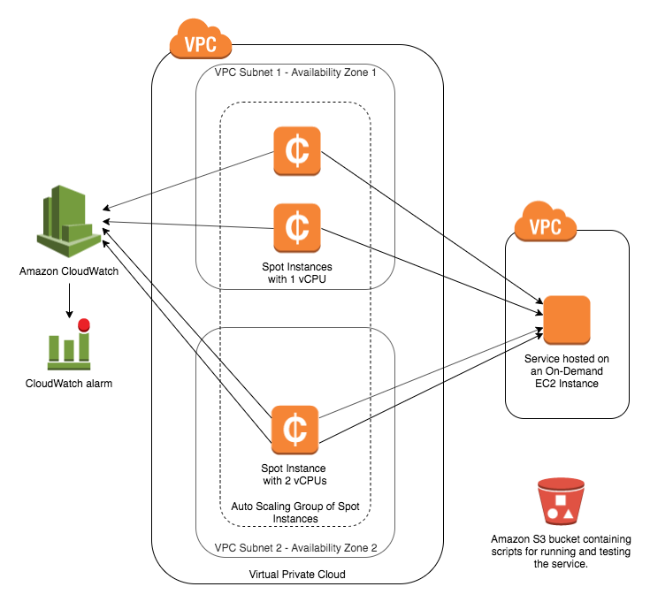

# Testing with EC2 Spot Instances and EC2 Auto Scaling groups

## Overview

This Builder Session will demonstrate how to leverage the EC2 Auto Scaling API to perform cost-effective automated testing with EC2 Spot Instances. We'll learn how to diversify an Auto Scaling group across instance pools to minimize the impact of interruptions, how to dynamically scale up the group size using scaling policies, and some strategies for handling Spot Instance interruptions. This is a fairly simple example - the goal is to get you familiar enough with Spot Instances to start experimenting with your own workloads. For more realistic load testing, consider integrating a framework like [Apache JMeter](https://jmeter.apache.org/) with your EC2 Instances.

## Requirements, notes, and legal
1. Please read the [Amazon EC2 Testing Policy](https://aws.amazon.com/ec2/testing/) before using any of the testing strategies presented in this session on your own services or workloads.

1. To complete this session, have access to an AWS account with administrative permissions. An IAM user with administrator access (**arn:aws:iam::aws:policy/AdministratorAccess**) will do nicely.

1. Make sure you have the latest version of the AWS CLI installed. https://docs.aws.amazon.com/cli/latest/userguide/installing.html

1. This session is configured to run in us-east-1. To run in a different region, make sure you pass equivalent AMIs as parameters when creating the CloudFormation stack.

1. While the session provides step by step instructions, please do take a moment to look around and understand what is happening at each step. The session is meant as a getting started guide, but you will learn the most by digesting each of the steps and thinking about how they would apply in your own environment. You might even consider experimenting with the steps to challenge yourself.

1. During this session, you will install software (and dependencies) on the Amazon EC2 instances launched in your account. The software packages and/or sources you will install will be from the [Amazon Linux 2](https://aws.amazon.com/amazon-linux-2/) distribution as well as from third party repositories and sites. Please review and decide your comfort with installing these before continuing.

1. Remember to complete the **Clean up all resources** section after you are done with this builder session, even if you haven't completed all the steps.


## Architecture

You will first upload the following to an S3 bucket:
* A [script](simple_server.py) for running the service to be tested. This service is a simple, single-threaded HTTP server that throttles incoming requests at 5 TPS.
* A [script](test_simple_server.py) for testing this service. This script spins up one thread per vCPU on the instance where it's running. Each thread continuously calls the target service at 1 TPS and publishes success and error metrics to CloudWatch.

Next, you will create the [CloudFormation stack](demo_setup.yaml) which performs most of the overhead setup for this builder session. This stack creates the following:
* a publicly accessible web server running on an On-Demand Instance
* prerequisites for launching an Auto Scaling group to test this web server. These prerequisites are:
  * a VPC
  * two subnets
  * a Launch Template, which includes the EC2 UserData that starts the test script
* a CloudWatch event rule that will publish to an SNS topic every time a Spot Instance is interrupted

Finally, you will deploy an [Auto Scaling group](asg_policy_template.json) using the Launch Template and subnets generated by the previous CloudFormation stack. This group will test the target web server and publish results to CloudWatch.

Here is a diagram of the resulting architecture:



## Steps

### 1. Checkout this repo

```
git clone https://github.com/awslabs/ec2-spot-labs
```

```
cd ec2-spot-labs/builder-sessions/test-dev-on-spot
```

### 2. Push the web server script and test script to S3

Create an S3 bucket.

```
your_name=<your_name_or_any_other_unique_string>
```

```
bucket=${your_name}-reinvent-ec2spottestdev-bucket
```

```
aws s3api create-bucket --bucket ${bucket}
```

Upload scripts to the bucket.

```
aws s3 cp simple_server.py s3://${bucket}/
```

```
aws s3 cp test_simple_server.py s3://${bucket}/
```

### 3. Create an ssh key pair

Create an SSH key pair. This can be used to SSH to any of the EC2 instances launched in this builder session.

```
aws ec2 create-key-pair \
  --key-name ReInvent-EC2SpotTestDev-KeyPair \
  --query 'KeyMaterial' \
  --output text \
  > ReInvent-EC2SpotTestDev-KeyPair.pem
```

```
chmod 400 ReInvent-EC2SpotTestDev-KeyPair.pem
```

### 4. Create the CloudFormation stack

Create the CloudFormation stack which performs most of the overhead setup for this builder session. This stack creates the following:
* an HTTP web server running on an On-Demand EC2 instance and publicly accessible at the "webServerPublicDns" field output from the stack
* prerequisites for launching an Auto Scaling group of Spot Instances to test this web server. These prerequisites are:
  * a VPC
  * two subnets
  * a Launch Template, which includes the EC2 UserData that starts the test script
* a CloudWatch event rule that will publish to an SNS topic every time a Spot Instance is interrupted

```
aws cloudformation create-stack \
  --template-body file://demo_setup.yaml \
  --parameters ParameterKey=s3Bucket,ParameterValue=${bucket} \
  --capabilities CAPABILITY_IAM \
  --stack-name ReInvent-EC2SpotTestDev-Stack
```

Wait for the stack creation to complete (StackStatus == CREATE_COMPLETE) - this will take a few minutes. While you wait, take a look at the [CloudFormation template](demo_setup.yaml) and [web server script](simple_server.py) to get an understanding of what's happening.

```
aws cloudformation describe-stacks \
  --stack-name ReInvent-EC2SpotTestDev-Stack \
  --query 'Stacks[0].StackStatus' \
  --output text
```

After the stack creation is complete, validate that the public web server we will test is running by navigating to it's public DNS in your brower. You should see a "Hello World!" message. Note that it may take another minute or two after the stack creation is complete before the web server boots up and can start serving traffic.

Command to parse the public DNS of the web server:

```
aws cloudformation describe-stacks \
  --stack-name ReInvent-EC2SpotTestDev-Stack \
  --query 'Stacks[0].Outputs[?OutputKey==`webServerPublicDns`].OutputValue' \
  --output text
```

An SNS topic named ReInvent-EC2SpotTestDev-SpotInterruptionTopic was created in this stack. This topic will publish for every Spot Instance that is interrupted.

Feel free to subcribe to this topic if you'd like to test this functionality (e.g. email or SMS). This can be done in the AWS Console at Services > SimpleNotificationService > Topics > ReInvent-EC2SpotTestDev-SpotInterruptionTopic > Actions > Subscribe to topic. You'll get an opt-in confirmation message that you'll also need to acknowledge to enable the notifications.


### 5. Launch an Auto Scaling group of Spot Instances to test our service

In step 4, we created two subnets and a Launch Template that we'll use for launching the testing group. Retrieve these values.

```
asg_launch_template_id=\
$(aws cloudformation describe-stacks \
  --stack-name ReInvent-EC2SpotTestDev-Stack \
  --query 'Stacks[0].Outputs[?OutputKey==`testAsgLaunchTemplate`].OutputValue' \
  --output text)
```

```
subnet_id_1=\
$(aws cloudformation describe-stacks \
  --stack-name ReInvent-EC2SpotTestDev-Stack \
  --query 'Stacks[0].Outputs[?OutputKey==`testAsgSubnet1`].OutputValue' \
  --output text)
```

```
subnet_id_2=\
$(aws cloudformation describe-stacks \
  --stack-name ReInvent-EC2SpotTestDev-Stack \
  --query 'Stacks[0].Outputs[?OutputKey==`testAsgSubnet2`].OutputValue' \
  --output text)
```

Now, build the input policy for the CreateAutoScalingGroup call.

```
sed s~%LAUNCH_TEMPLATE_ID%~${asg_launch_template_id}~ asg_policy_template.json > asg_policy.json
```

Create the Auto Scaling group.

```
aws autoscaling create-auto-scaling-group \
  --auto-scaling-group-name reinvent-ec2spottestdev-asg \
  --min-size 4 \
  --max-size 10 \
  --vpc-zone-identifier "${subnet_id_1},${subnet_id_2}" \
  --mixed-instances-policy file://asg_policy.json
```

Take note of some important configuration values in the Auto Scaling group that we just created:
* WeightedCapacity (in the [group policy](asg_policy_template.json))
  * We've weighted each instance type by the number of vCPUs.
* SpotAllocationStrategy: capacity-optimized (in the [group policy](asg_policy_template.json))
  * The Spot Instances come from the pool with optimal capacity for the number of instances that are launching.
  * In this context, a "pool" is the combination of instance type (e.g. t2.small) and Availability Zone.
* min-size: 4
  * This is the initial target capacity for the group, taking into account weighting. So, in our example, we're requesting a group of Spot Instances that combine for 4 total vCPUs.
  * In this case, we've requested all Spot Instances, but it is possible to mix On-Demand and Spot Instances in the same group.
* vpc-zone-identifier
  * The group will try to balance the target capacity equally across each of these subnets.

Wait for the group to launch (LifeCycleState of all instances == 'InService', sum of WeightedCapacity across all instances == 4).

```
aws autoscaling describe-auto-scaling-groups \
  --auto-scaling-group-names reinvent-ec2spottestdev-asg \
  --query 'AutoScalingGroups[0].Instances[*].[AvailabilityZone,WeightedCapacity,LifecycleState,HealthStatus,InstanceType]'
```

We've now launched a group of Spot Instances totaling 4 vCPUs balanced across 2 Availability Zones. If Spot capacity decreases in one of the pools where we've launched, one or more of our instances may have to be interrupted. In this case, the group will automatically try to replenish the missing capacity using another pool. This is why it's important to diversify the number of pools in your request as much as possible.


### 6. Scale up the Auto Scaling group size to test the limits of the target service using an Auto Scaling Policy

Create a scaling policy.

```
aws autoscaling put-scaling-policy \
  --auto-scaling-group-name reinvent-ec2spottestdev-asg \
  --policy-name reinvent-ec2spottestdev-scaling-policy \
  --policy-type TargetTrackingScaling \
  --target-tracking-configuration file://scaling_policy_config.json
```

We've created an Auto Scaling Policy here such that our group will scale up until the testing script success rate is [reduced to 85%](scaling_policy_config.json) or the group reaches a maximum size of 10 vCPUs. Remember, we weighted each instance type by number of vCPUs, so capacity is equal to vCPUs in this case.


### 7. Verify the Auto Scaling group scales as expected

The test group should be running and publishing test results as CloudWatch metrics. Verify this in the AWS Console at Services -> CloudWatch -> Metrics -> ReInvent-EC2SpotTestDev-Metrics. View the Sum of the "Error" and "Success" metrics with a 1 Minute Period. At the current group size (4 vCPUs), tests should be initially be succeeding because our test group calls the target web server at 1 TPS per vCPU (so, 4 TPS total) and the web server can handle 5 TPS.

Next, navigate to Services > CloudWatch -> Alarms. An alarm should have been created as part of the Auto Scaling Policy called TargetTracking-reinvent-ec2spottestdev-asg-AlarmHigh-\<UUID\>. This may be marked as INSUFFICIENT_DATA, but should soon move to ALARM. The nroup should then continue to scale up until our testing group is seeing a sufficient number of errors when calling the target web server.

You can verify this by keeping an eye on the alarm - the metric should drop until the alarm changes to OK. Once the alarm moves to OK, check the new group size at which our target service failing under the load.

```
aws autoscaling describe-auto-scaling-groups \
  --auto-scaling-group-names reinvent-ec2spottestdev-asg \
  --query 'AutoScalingGroups[0].Instances[*].[AvailabilityZone,WeightedCapacity,LifecycleState,HealthStatus,InstanceType]'
```

Delete the Auto Scaling Policy.

```
aws autoscaling delete-policy \
  --auto-scaling-group-name reinvent-ec2spottestdev-asg \
  --policy-name reinvent-ec2spottestdev-scaling-policy
```

Delete the Auto Scaling group.

```
aws autoscaling delete-auto-scaling-group \
  --auto-scaling-group-name reinvent-ec2spottestdev-asg \
  --force-delete
```

This is a good stopping point in the Builder Session as we've demonstrated how to create an Auto Scaling group of Spot Instances for testing a service and how to dynamically scale up the size of this group. If you'd like to stop now, remember to execute the cleanup steps at end of this document.

If you'd like to continue and learn some strategies for Spot Instance interruption handling, continue on to the next section.


## Spot Instance interruption handling strategies

The Spot Instances that we launched in the previous steps were stateless. Each Instance is simply calling the target web server and posting results back to CloudWatch. If an Instance is interrupted, the Auto Scaling group will automatically replace it with a new one.

However, in many use cases, some additional logic may be desired when handling Spot Instance interruptions. Some examples:
* Saving the application state.
* Uploading final log files.
* Removing an instance from an Elastic Load Balancer.
* Pushing SNS notifications.
* Draining containers.

Spot Instances get a 2 minute notice before they'll be shut down, via both CloudWatch events and the instance metadata.

Spot instances also support 3 different interruption behaviors:
* terminate
* stop - EBS volume is saved and restored when the instance starts again
* hibernate - EBS volume and RAM are saved and restored when the instance starts again

See the documentation for detailed information on Spot Instance interruptions: https://docs.aws.amazon.com/AWSEC2/latest/UserGuide/spot-interruptions.html

You can test interruption handling by scaling down a Fleet of Spot Instances created via the EC2 CreateFleet API.


### 8. Subscribe to CloudWatch events

In step 4 (creating the CloudFormation stack), we created a CloudWatch event rule that will publish to the SNS topic named ReInvent-EC2SpotTestDev-SpotInterruptionTopic for every Spot Instance that is interrupted. If you didn't already as part of step 4, you can subscribe to this topic if you'd like to test the functionality (e.g. email or SMS). This can be done in the AWS Console at Services > SimpleNotificationService > Topics > ReInvent-EC2SpotTestDev-SpotInterruptionTopic > Actions > Subscribe to topic. You'll get an opt-in confirmation message that you'll also need to acknowledge to enable the notifications.


### 9. Create a Fleet of Spot Instances to be interrupted

Create a Fleet of Spot Instances. We'll use an EC2 Fleet instead of an Auto Scaling group because scaling down an EC2 Fleet triggers Spot Instance interruption notices. To keep things simple, we can use the same subnets created in the previous steps. 

```
spot_itn_launch_template_id=\
$(aws cloudformation describe-stacks \
  --stack-name ReInvent-EC2SpotTestDev-Stack \
  --query 'Stacks[0].Outputs[?OutputKey==`spotItnLaunchTemplate`].OutputValue' \
  --output text)
```

```
sed s~%LAUNCH_TEMPLATE_ID%~${spot_itn_launch_template_id}~ ec2_fleet_template.json \
  | sed s~%SUBNET_ID_1%~${subnet_id_1}~ \
  | sed s~%SUBNET_ID_2%~${subnet_id_2}~ \
  > ec2_fleet.json
```

```
fleet_id=\
$(aws ec2 create-fleet \
  --cli-input-json file://ec2_fleet.json \
  --query 'FleetId' \
  --output text)
```

Wait for the Fleet to be fulfilled (ActivityStatus == 'fulfilled' and FulfilledCapacity == 2.0)

```
aws ec2 describe-fleets \
  --fleet-ids ${fleet_id} \
  --query 'Fleets[0].[ActivityStatus,FulfilledCapacity]'
```

If the Fleet isn't being fulfilled, you can debug using the Fleet history.

```
aws ec2 describe-fleet-history \
  --fleet-id ${fleet_id} \
  --start-time 2019-11-01
```

### 10. Trigger Spot Instance interruptions

Now reduce the Fleet size, which should trigger Spot interruptions.

```
aws ec2 modify-fleet \
  --fleet-id ${fleet_id} \
  --excess-capacity-termination-policy termination \
  --target-capacity-specification TotalTargetCapacity=0
```

### 11. Verify Spot Instance interruption notices

Retrieve the public DNS of the Instance being interrupted.

```
spot_instance_dns=\
$(aws ec2 describe-instances \
  --filters Name=tag:aws:ec2:fleet-id,Values=${fleet_id} \
  --query 'Reservations[0].Instances[0].PublicDnsName' \
  --output text)
```

Verify the the metadata on the Instance. Note that you may have to wait a minute for the Instance termination notice to appear (you will get 404 errors before then). The Instance should be terminated two minutes after the notice is delivered.

```
ssh -i ReInvent-EC2SpotTestDev-KeyPair.pem ec2-user@${spot_instance_dns}
```

```
curl http://169.254.169.254/latest/meta-data/spot/instance-action
```

You should also have received a notification on the SNS Topic for every Spot Instance that was interrupted. Note that in this example we've created an SNS topic, but CloudWatch event rules are flexible and can even be configured to trigger Lambda functions.


## Clean up all resources

Delete your subscription to the ReInvent-EC2SpotTestDev-SpotInterruptionTopic if you created one. This can be done via the AWS Console at Services > Simple Notification Service > Subscriptions > Actions > Delete Subscriptions

Delete the EC2 Fleet used for testing interruption notices.

```
aws ec2 delete-fleets \
  --fleet-id ${fleet_id} \
  --terminate-instances
```

Delete the Auto Scaling group and scaling policy if you didn't already do this as part of Step 7.

```
aws autoscaling delete-policy \
  --auto-scaling-group-name reinvent-ec2spottestdev-asg \
  --policy-name reinvent-ec2spottestdev-scaling-policy
```

```
aws autoscaling delete-auto-scaling-group \
  --auto-scaling-group-name reinvent-ec2spottestdev-asg \
  --force-delete
```

Delete the CloudFormation Stack.

```
aws cloudformation delete-stack \
  --stack-name ReInvent-EC2SpotTestDev-Stack
```

Empty and delete the S3 bucket.

```
aws s3 rm s3://${bucket} --recursive
```

```
aws s3api delete-bucket \
  --bucket ${bucket}
```

Delete the SSH key pair.

```
aws ec2 delete-key-pair \
  --key-name ReInvent-EC2SpotTestDev-KeyPair
```

## Summary

In this session, we've demonstrated how to create a Auto Scaling group of Spot Instances to test a service. This pattern can be useful in a variety of scenarios:
* Unit and integration testing - leverage the EC2 Auto Scaling API to find the best Spot pool(s) that fits your needs when you need to test a new change.
* Performance testing - incrementally scale up a group to test the limits of your service.
* Continuous black box testing - maintain a group that continuously verifies the functionality of your service.

We also introduced some strategies for handling interruptions.

If you're interested in integrating Spot Instances into a CI/CD workflow, you should check out our Jenkins and Atlassian Bamboo plugins:
* Jenkins:
  * [GitHub](https://github.com/awslabs/ec2-spot-jenkins-plugin)
  * [Jenkins wiki](https://wiki.jenkins.io/display/JENKINS/Amazon+EC2+Fleet+Plugin)
  * [YouTube tutorial](https://www.youtube.com/watch?v=8gGItacZjps)
* Atlassian Bamboo
  * [GitHub](https://github.com/awslabs/ec2-spot-fleet-bamboo-plugin)
  * [Atlassian Marketplace](https://marketplace.atlassian.com/apps/1218167/awsspotfleetbambooplugin?hosting=server&tab=overview)
