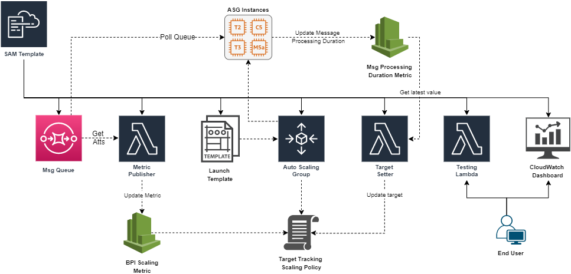
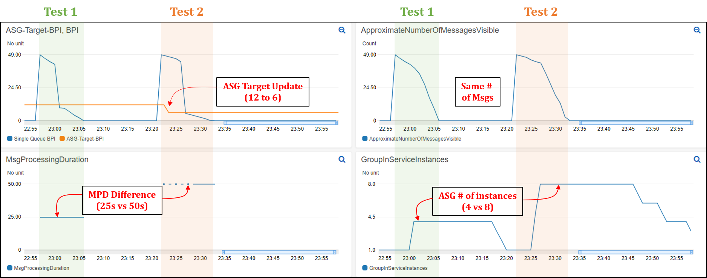

# asg-dynamic-target-tracking

## Overview
[Scaling an EC2 Auto Scaling group based on Amazon Simple Queue Service (SQS)](https://docs.aws.amazon.com/autoscaling/ec2/userguide/as-using-sqs-queue.html) is a commonly used design pattern. This post builds on this pattern to focus on latency-sensitive applications where the message processing duration (MPD) varies over time. Specifically, we demonstrate how to dynamically update the target value of the Auto Scaling group’s target tracking policy based on observed changes in the message processing duration. This allows the scaling policy to adapt to variations in the average MPD over time, and as a result enables the application to honor its acceptable latency.

To achieve this, we provide an automated deployment solution using an AWS SAM template that you can deploy by following the instructions below. Figure 1 below shows the architecture diagram and the resources deployed by the SAM template. For more information, please read the associated AWS blog post here.  

*Figure 1: Architecture Diagram showing the components deployed by the SAM template*

## Getting started

For this walkthrough, you should have the following prerequisites: 
- An AWS account
- AWS CLI installed 
- SAM CLI installed 

There are three steps involved in the deployment of this solution which include preparing an artifact bucket, deploying the SAM template, and performing a couple of scaling tests to demonstrate how the ASG’s target is dynamically updated to handle variations in MPD. 

## Prepare artefact bucket
1.	Create S3 bucket to store code artifacts (example name: “accountId-code-bucket”) 
2.	Clone the repository and open a terminal inside the destination folder
3.	Upload consumer code (consumer.py) to S3 bucket
    - `aws s3 cp queue-consumer/consumer.py s3://accountId-code-bucket`

## Deploy the SAM template
1.	Deploy the SAM template using this command
    - `sam deploy --guided --capabilities CAPABILITY_NAMED_IAM`
2.	Provide values for the parameter prompts: 
    - Stack Name: choose default or custom name
    - AWS Region: choose same region where bucket was created
    - QueueName: leave default
    - AsgName: choose default or custom name
    - AsgPublicSubnetIds: provide a comma separated list of public subnet ids (with auto-assign IPv4 address setting on) where instances will be created. 
    - Owner: type in your name (used for tagging resources)
    - CodeBucketName: type in the name of the previously created bucket (e.g. accountId-code-bucket)
    - EstMsgProcDuration: estimated average message processing duration in seconds. In this example, we will use a value of 25s. 
    - DesiredLatency: Max latency for processing any message in the queue. In this example, we will use a value of 300s. 
    - InitialTrackingTarget: Initial target value of the ASG's target tracking policy. It should equal desiredLatency/EstMsgProcDuration. In this example, we will use a value of 12 (=300/25)
    - TargetUpdateFrequency: the frequency in minutes with which the target value of the scaling policy is updated. Value should be between 1 and 59 minutes. In this example, we wil use a value of 1min. 
    - LatestAmiId: leave default
3.	For the remaining prompts, use the default values. Note: for any following deployments, you can simply use “sam deploy” command as all your selected options have been saved to a configuration file. 
4.	Wait for the changeset to be created. You can track the stack progress on the CloudFormation console. 

## Test the solution
### Scaling Test 1: using a simulated MPD of 25s 
1.	Make sure the CloudFormation stack's creation is complete
2.	Navigate to the Lambda console, and select the "DTT-Message-Producer" function
3.	Verify that the default MPD is set to 25s by navigating to Configuration tab > Environment Variables 
4.	Run the lambda function by navigating to the Test tab, then click on the Test button. This will send 50 messages to the processing qeue.
5.	Navigate to the CloudWatch service console, select Dashboards from the left-hand menu, and select the "ASG-Scaling-Dashboard".
6.	Watch the dashboard metrics over the next 15mins and observe the following: 
    - Target BPI is set to 12 since desired latency is 300s and MPD is 25s. 
    - Since 50 messages were sent to the queue and only 1 ASG instance is in-service initially, the BPI value rises to 50.
    - Since the BPI stays higher than target BPI for over 3 minutes, the ASG will launch new instances. In this case, a total of 4 instances are operational after a few minutes (since ratio of BPI / target BPI = 4)
    - After BPI decreases below target BPI for 15mins, the ASG starts to scale down back to 1 instance
### Scaling Test 2: using a simulated MPD of 50s 
1.	Before starting this test, wait for Test 1 to complete and for the GroupInServiceInstances metric on the CloudWatch dashboard to go back to one instance. 
2.	Navigate to the Lambda console, and select the "DTT-Message-Producer" function again
3.	Change the "defaultMsgProcDuration" (aka. MPD) to 50s by navigating to the Configuration tab, then select Environment Variables menu item, and click Edit. 
4.	Run the function again by clicking on the Test button in the Test tab 
5.	Navigate again to the CloudWatch dashboard and watch the metrics over the next 15mins. Observe: 
    - As soon as the first message is processed, the MPD metric value jumps to 50s from 25s.
    - Since messages are now taking twice as long to process, one should expect intuitively that more instances should be launched if we are to process the same number of messages in the same time (acceptable latency). This can be observed in the new target BPI value of 6 (latency of 300 / MPD of 50). 
    - Given the new target BPI, the ASG will have a total of 8 instances in-service (given the ratio of BPI / target BPI = 50 / 6 = 8) 
    - After BPI decreases below target BPI for 15min, the ASG will start scaling down back to 1 instance. 

### Comparing the two tests
Despite the fact that Test 2 messages take twice as long to process, notice that the Auto Scaling group launched twice as many instances to attempt to process all the messages in the same amount of time as Test 1 (latency). Figure 2 below shows that the total time to process all 50 messages in Test 1 was 9mins vs 10mins in Test 2. In contrast, if we were to use a static/fixed Acceptable BPI of 12, a total of 4 instances would have been operational in Test 2, thereby requiring double the time of Test 1 (~20 minutes) to process all the messages. This demonstrates the value of using a dynamic scaling target when processing messages from SQS queues, especially in circumstances where the MPD is prone to vary with time.

*Figure 2: CloudWatch dashboard showing Auto Scaling group scaling test results (Test 1 & 2)*

## Cleaning up
To avoid incurring future charges, delete the resources deployed:
- Empty artifact bucket and delete it
- Delete CloudFormation stack deployed by SAM

## Conclusion
As can be seen from the test results, this approach demonstrates how an Auto Scaling group can honor a user-provided acceptable latency constraint while accomodating
variations in the message processing duration over time. This is possible because the average message processing duration (MPD) is monitored and regularly updated as a
CloudWatch metric, which in turn is continously used to update the target value of the group’s target tracking policy. 

