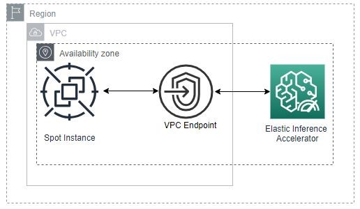
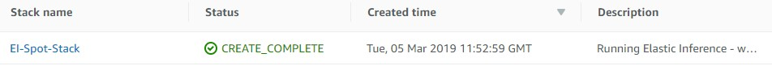
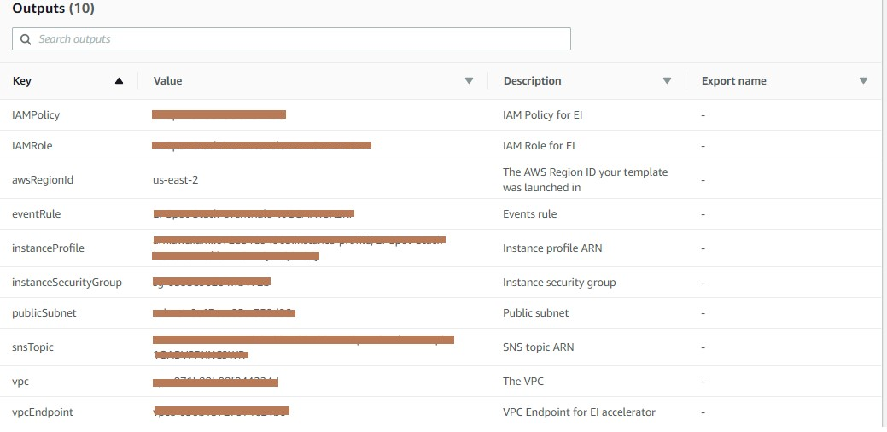
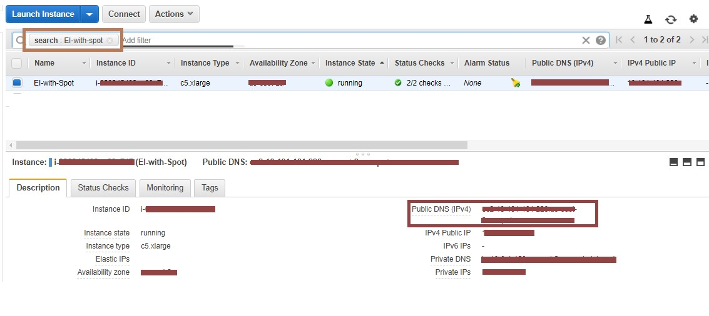

# Running Amazon Elastic Inference on Amazon EC2 Spot Instances

## Overview
This workshop is designed to get you familiar with the concepts and best practices for requesting Amazon EC2 instances with Elastic Inference.

## Requirements, notes, and legal
1.	To complete this workshop, have access to an AWS account with administrative permissions. An IAM user with administrator access **(arn:aws:iam::aws:policy/AdministratorAccess)** will do nicely.
2.	**This workshop is self-paced.** The instructions will primarily be given using the AWS Command Line Interface (CLI) - this way the guide will not become outdated as changes or updates are made to the AWS Management Console. However, most steps in the workshop can be done in the AWS Management Console directly. Feel free to use whatever is comfortable for you.
3.	While the workshop provides step-by-step instructions, please do take a moment to look around and understand what is happening at each step. The workshop is meant as a getting started guide, but you will learn the most by digesting each of the steps and thinking about how they would apply in your own environment. You might even consider experimenting with the steps to challenge yourself.
4.	This workshop has been designed to run in any public AWS Region that supports Elastic Inference. See Regional Products and Services for details.
To save time on the initial setup, a CloudFormation template will be used to create the Amazon VPC with subnets, as well as various supporting resources including IAM policies and roles, security groups, and a VPC endpoint for you to run the steps for the workshop in.

5.	During this workshop, you will install software (and dependencies) on the Amazon EC2 instances launched in your account. The software packages and/or sources you will install will be from the Amazon Linux 2 distribution as well as from third party repositories and sites. Please review and decide your comfort with installing these before continuing.

## Architecture
In this workshop, you will deploy the following:

An AWS CloudFormation stack, which will include:

* An Amazon Virtual Private Cloud (Amazon VPC) 
* An Amazon Elastic Inference accelerator
* VPC Endpoint for Amazon Elastic Inference accelerator
* Supporting IAM policies and roles
* Supporting security groups
* An Amazon EC2 Launch Template
* An Amazon EC2 fleet to deploy EC2 Spot instance(s)

Here is a diagram of the resulting architecture:



**Let's Begin**
## Launch the CloudFormation Stack
To save time on the initial setup, a CloudFormation template will be used to create the Amazon VPC with subnets, as well as various supporting resources including IAM policies and roles, security groups, and a VPC endpoint for you to run the steps for the workshop in.

**To create the stack**
1.	You can view and download the CloudFormation temlpate from GitHub [here](https://github.com/chakravn/ec2-spot-labs/blob/master/ec2-spot-elastic-inference/EI_Spot_CFN.yaml)
2.	Take a moment to review the CloudFormation template so you understand the resources it will be creating.
3.	Browse to the [AWS CloudFormation console](https://console.aws.amazon.com/cloudformation).
Note: Make sure you are in the appropriate AWS Region 
4.	Click **Create stack**.
5.	In the **Specify template** section, select **Upload** a template file. Click **Choose file** and, select the template you downloaded in step 1.
6.	Click Next.
7.	In the Specify stack details section, enter a Stack name. For example, use *EI-Spot-Stack*. The stack name cannot contain spaces.
8.	**Optional** In the **Parameters** section, optionally change the **sourceCidr** to restrict instance ssh/http access.
9.	Click Next
10.	In **Configure stack options**, you don't need to make any changes.
11.	Click **Next**.
12.	Review the information for the stack. At the bottom under **Capabilities**, select **I acknowledge that AWS CloudFormation might create IAM resources**. When you're satisfied with the settings, click **Create stack**.

**Monitor the progress of stack creation**
It will take roughly 5 minutes for the stack creation to complete.
1.	On the [AWS CloudFormation console](https://console.aws.amazon.com/cloudformation), select the stack in the list.
2.	In the stack details pane, click the **Events** tab. You can click the refresh button to update the events in the stack creation.

The **Events** tab displays each major step in the creation of the stack sorted by the time of each event, with latest events on top.

The **CREATE_IN_PROGRESS** event is logged when AWS CloudFormation reports that it has begun to create the resource. The **CREATE_COMPLETE** event is logged when the resource is successfully created.

When AWS CloudFormation has successfully created the stack, you will see the following event at the top of the Events tab:


**Use your stack resources**
In this workshop, you'll need to reference the resources created by the CloudFormation stack.

1.	On the [AWS CloudFormation console](https://console.aws.amazon.com/cloudformation), select the stack in the list.
2.	In the stack details pane, click the **Outputs** tab which looks like below.


It is recommended that you keep this window open so you can easily refer to the outputs and resources throughout the workshop.

## Update the AWS CLI and install dependencies
1.	Make sure the latest version of the AWS CLI is installed by running:

```
sudo pip install -U awscli
```

## Clone the workshop GitHub repo
In order to execute the steps in the workshop, you'll need to clone the workshop GitHub repo.
1.	In the terminal, run the following command:
```
git clone https://github.com/awslabs/ec2-spot-labs.git
```
2. Change into the workshop directory:
```
cd ec2-spot-labs/ec2-spot-elastic-inference
```

## Create an EC2 launch template

EC2 Launch Templates reduce the number of steps required to create an instance by capturing all launch parameters within one resource.

You can create a launch template that contains the configuration information to launch an instance. Launch templates enable you to store launch parameters so that you do not have to specify them every time you launch an instance. For example, a launch template can contain the AMI ID, Arn, and network settings that you typically use to launch instances. When you launch an instance using the Amazon EC2 console, an AWS SDK, or a command line tool, you can specify the launch template to use.
You'll use a launch template to specify configuration parameters for launching instances in this workshop.

1.	Edit EI_launch_template.json and update as follows
2.	Update the following values from the CloudFormation Outputs tab.

| **Parameter**                                             | **Description** |
| -------------                                             | -------------   |
| **%instanceProfile%**                                     | instanceProfile created by Cloudformation stack. For example, “arn:aws:iam::XXXXXXXXXXX:instance-profile/EI-Spot-Stack-instanceProfile-XXXXXXXX”    |
| **%key-name%**                                            | Your existing SSH key pair Note: This will not be available from CloudFormation stack. Either you need to use your existing SSH key pair or create a new key pair as per [](https://docs.aws.amazon.com/AWSEC2/latest/UserGuide/ec2-key-pairs.html#having-ec2-create-your-key-pair)  |
| **%instanceSecurityGroup%**                                | InstanceSecurityGroup created y CloudFormation stack. For example, “sg-XXXXXXXXXXXXXX” |
| **InstanceType, ElasticInferenceAccelerators and ImageId** | The provided launch template has some default values for InstanceType, ElasticInferenceAccelerators and ImageId. But please feel free to update them if required.  |

**Note: The ImageId provided in this workshop is one of the "Deep Learning AMI" from us-east-2 region. Please update the ImageId according to the Region/User specific requirements.**

3.	Save the File.
4.	Create the launch template from the launch template config you just saved:
```
aws ec2 create-launch-template --launch-template-name EI_spot --cli-input-json file://EI_launch_template.json
```
5.	Browse to the Launch Templates console and check out your newly created launch template.
6.	Verify that the contents of the launch template are correct:
```
aws ec2 describe-launch-template-versions  --launch-template-name EI_spot
```
## Create EC2 Fleet

1.	Edit ec2_fleet.json and update as follows.
*Note: This is only a reference EC2_fleet configuration, please feel free to update if required.*

| Parameter     | Description   |
| ------------- | ------------- |
| **LaunchTemplateName**  | Update the LauchTemplateName as “EI_spot” as created above  |
| **%publicSubnet%**  | Update the subnet from the “publicSubnet” of CloudFormation Outputs tab. For example, “subnet-0XXXXXXXXXXX”  |
| **InstanceType**    | **Optional** - The provided EC2 fleet json has some instance types. Please update the Instance Types as required |
| **"TotalTargetCapacity": “X”, "OnDemandTargetCapacity": “Y”, "SpotTargetCapacity": “Z”, "DefaultTargetCapacityType": ""**  | **Optional** – The provided EC2 fleet json has some values on TotalTargetCapacity, OnDemandTargetCapacity, SpotTargetCapacity and DefaultTargetCapacityType. According to your compute target capacity, update TotalTargetCapacity, OnDemandTargetCapacity, SpotTargetCapacity and DefaultTargetCapacityType if needed. |

2.	Create the EC2 fleet as follows.
```
aws ec2 create-fleet --cli-input-json file://ec2_fleet.json
```
3.	Optional - Describe Fleet
```
aws ec2 describe-fleets --fleet-id $FLEETID
```
4.	**Optional** – Describe Fleet History
```
aws ec2 describe-fleet-history --fleet-id $FLEETID --start-time 2019-03-01
```

## Running Inference on the launched Spot Instance with Elastic Inference

1.	Navigate to (https://console.aws.amazon.com/ec2/) 
2.	In the navigation pane, click on Instances
3.	Filter the instance using the tag EI-with-spot as below



4. Note down the Public DNS(IPV4) and connect using your SSH key pair with your SSH client as below


5. Once you logon to the instance, do yum update as follows..
```
[ec2-user@ip-XX-X-X-XXX ~]$ sudo yum -y update
```
6. Validate the Elastic Inference Setup by running “python ~/anaconda3/bin/EISetupValidator.py” and the expected response should be as below.
```
[ec2-user@ip-XX-X-X-XXX ~]$ python ~/anaconda3/bin/EISetupValidator.py
```
Expected Output:
```
All the validation checks passed for Amazon EI from this instance - <instance-ID>
```
7. Activate the “amazonei_mxnet_p36” source as below
```
[ec2-user@ip-XX-X-X-XXX ~]$ source activate amazonei_mxnet_p36
```
8. Download some sample images for inferencing as below using “wget”
```
(amazonei_mxnet_p36) [ec2-user@ip-XX-X-X-XXX ~]$ wget -O dog.jpg 'https://github.com/dmlc/web-data/blob/master/mxnet/doc/tutorials/python/predict_image/dog.jpg?raw=true'

(amazonei_mxnet_p36) [ec2-user@ip-XX-X-X-XXX ~]$ wget -O cat.jpg 'https://github.com/dmlc/web-data/blob/master/mxnet/doc/tutorials/python/predict_image/cat.jpg?raw=true'
```
9. Clone the reference Inference python script from [here](https://github.com/awslabs/ec2-spot-labs/tree/master/ec2-spot-elastic-inference/EI_mxnet_module_API_Resnet50.py) and run it as below which provides the expected output as below
```
(amazonei_mxnet_p36) [ec2-user@ip-XX-X-X-XXX ~]$ python EI_mxnet_module_API_Resnet50.py --image dog.jpg

Image: dog.jpg
[14:00:16] src/nnvm/legacy_json_util.cc:209: Loading symbol saved by previous version v0.8.0. Attempting to upgrade...
[14:00:16] src/nnvm/legacy_json_util.cc:217: Symbol successfully upgraded!
Using Amazon Elastic Inference Client Library Version: 1.2.11
Number of Elastic Inference Accelerators Available: 1
Elastic Inference Accelerator ID: eia-524016fc786f4ea2a0fa31e2863c4694
Elastic Inference Accelerator Type: eia1.medium

probability=0.922678, class=n02110958 pug, pug-dog
probability=0.043061, class=n02108422 bull mastiff
probability=0.004693, class=n02112706 Brabancon griffon
probability=0.002079, class=n01692333 Gila monster, Heloderma suspectum
probability=0.001720, class=n02093754 Border terrier
```

## Cleanup
1. Delete all manually created resources.
  * Delete the EC2 fleet
```
aws ec2 delete-fleets --fleet-id <$fleet-id> --terminate-instances
```
  * Delete the Launch template
```
aws ec2 delete-launch-template --launch-template-name "EI_spot"
```
2. Delete the CloudFormation stack
```
aws cloudformation delete-stack --stack-name <$stack-name>
```

## References
[Elastic Inference - User Guide](https://docs.aws.amazon.com/AWSEC2/latest/UserGuide/elastic-inference.html )


