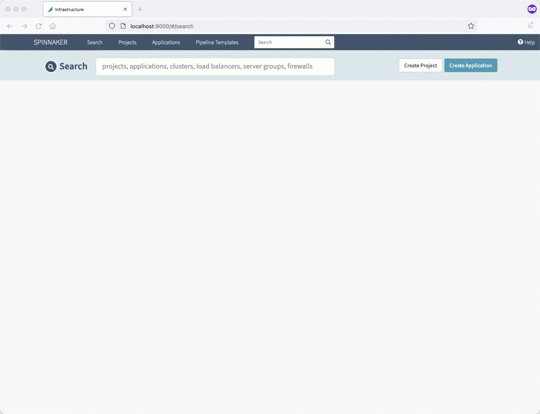
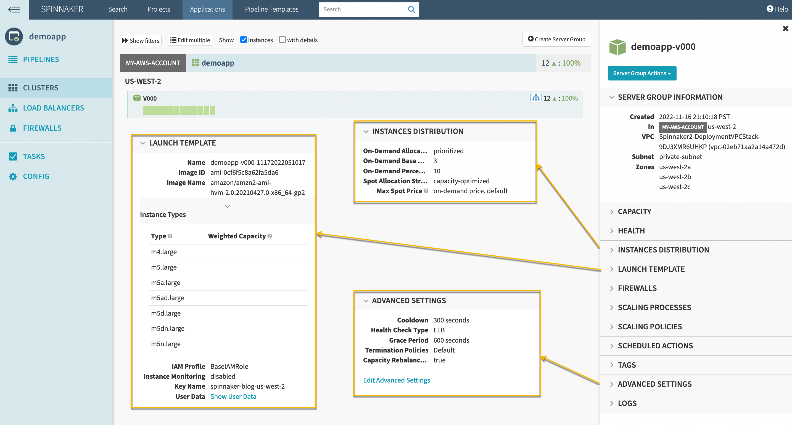
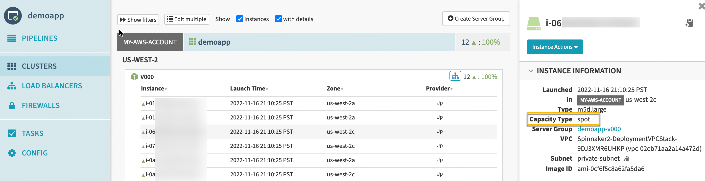
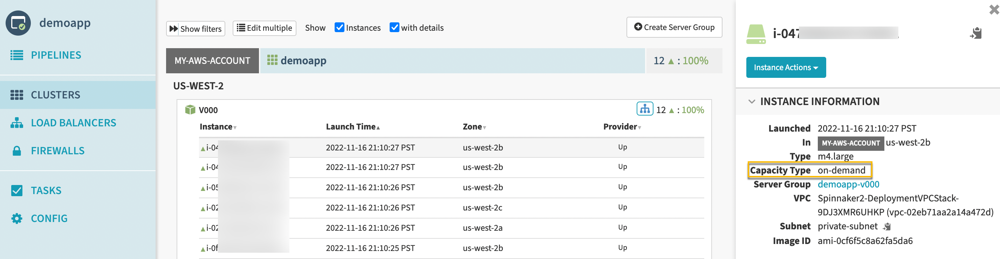
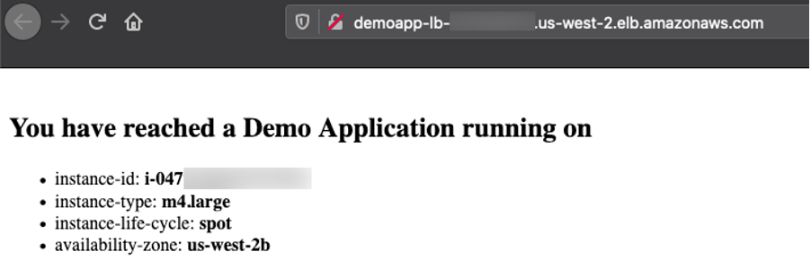
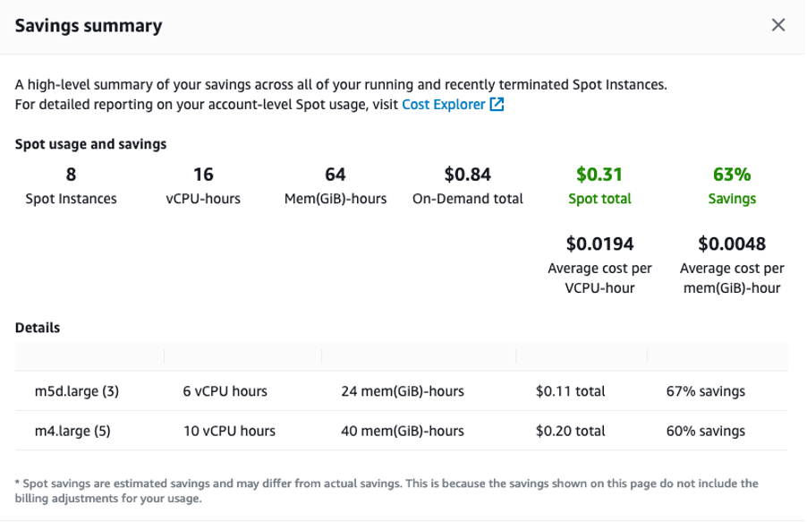

# Building diversified and cost-optimized EC2 server groups in Spinnaker

[Spinnaker](https://www.spinnaker.io/) is an open source continuous delivery platform created by Netflix for releasing software changes rapidly and reliably. It enables teams to automate deployments into pipelines that are run whenever a new version is released with proven [deployment strategies](https://spinnaker.io/docs/concepts/#deployment-strategies) which are faster and dependable with zero downtime. For many AWS customers, including [Airbnb](https://techbeacon.com/app-dev-testing/how-airbnb-scaled-its-migration-continuous-delivery-spinnaker), [Pinterest](https://youtu.be/8rQ932BtlA8?list=PL4yLrwUObNkvGzXKSEU8miQTlvZyZvXWq), [Snap](https://youtu.be/u5osLmRx48A?list=PL4yLrwUObNkvGzXKSEU8miQTlvZyZvXWq), [Autodesk](https://youtu.be/wP8heChPOc0?list=PL4yLrwUObNkvGzXKSEU8miQTlvZyZvXWq), [Netflix](https://youtu.be/dSPthXhU8IQ?t=315) and [Salesforce](https://youtu.be/o-b76HIIe2s?list=PL4yLrwUObNkvGzXKSEU8miQTlvZyZvXWq), Spinnaker is a critical piece of technology that allows their developers to deploy their applications safely and reliably across different AWS managed services.

Listening to customer requests on the Spinnaker [open source project](https://github.com/spinnaker/spinnaker/issues/2866)and in the [EC2 Spot Integrations roadmap](https://github.com/aws/ec2-spot-instances-integrations-roadmap/issues/11), we have further enhanced Spinnaker's ability to deploy on [Amazon Elastic Compute Cloud (Amazon EC2)](https://spinnaker.io/setup/install/providers/aws/aws-ec2/). The enhancements make it easier to combine Spot Instances with On-Demand, RIs and Savings Plans Instances to optimize workload cost with performance. You can improve workload availability when using Spot instances with features such as allocation strategies, proactive [Spot capacity rebalancing](https://aws.amazon.com/blogs/compute/proactively-manage-spot-instance-lifecycle-using-the-new-capacity-rebalancing-feature-for-ec2-auto-scaling/), and using multiple Instance Types. Combinations of these features offer the best possible experience when using Amazon EC2 with Spinnaker.

## **Spinnaker & AWS EC2 Integration**

Back in mid-2020, we started looking into customer requests and gaps in the Amazon EC2 feature set supported in Spinnaker. Around the same time, Netflix added support for [Amazon EC2 Launch Templates](https://docs.aws.amazon.com/autoscaling/ec2/userguide/LaunchTemplates.html). Thanks to their effort, we were able to follow-up and expand the AWS EC2 feature set supported in Spinnaker. Learn more about Spinnaker and AWS EC2 integration on [spinnaker.io](https://spinnaker.io/docs/setup/other_config/server-group-launch-settings/aws-ec2/).

 Here are some highlights of the features contributed recently:

|  **Feature**  | **Why use it? (Example use cases)** |
| --- | --- |
| _Multiple Instance Types_ | Tap into multiple capacity pools to achieve and maintain the desired scale using Spot instances. |
| Combining On-Demand and Spot instances | <ul> <li>Control the proportion of On-Demand and Spot instances launched in your sever group. </li> <li>Combine Spot instances with [Amazon EC2 Reserved Instances](https://aws.amazon.com/ec2/pricing/reserved-instances/) or [Savings Plans](https://aws.amazon.com/savingsplans/). </li> </ul>|
| _EC2 Auto Scaling allocation strategies_ | Reduce overall Spot interruptions by launching from Spot pools that are optimally chosen based on the available Spot capacity, using capacity-optimized Spot allocation strategy. |
| _Capacity rebalancing_ | Improve your workload availability by proactively shifting your Spot capacity to optimal pools by enabling capacity rebalancing along with capacity-optimized allocation strategy.|
| _Improved support for_ [_burstable performance instance types_](https://docs.aws.amazon.com/AWSEC2/latest/UserGuide/burstable-performance-instances.html) _with custom credit specification_ | Reduce costs by preventing wastage of CPU cycles. |

We recommend using Spinnaker stable release 1.28.x for API users and 1.29.x for UI users. Here is the [Git issue](https://github.com/spinnaker/spinnaker/issues/5989) you can look at for related PRs and feature releases.

Now that we understand the new features, let's take a look at how to use some of them in the tutorial below.

# **Example tutorial: Deploy a demo web application on an ASG with On-Demand and Spot Instances**

In this example tutorial, we will setup Spinnaker to deploy to Amazon EC2, create a load balancer and deploy a demo application on a Server Group diversified across multiple instance types and purchase options. The server group is setup with a base On-Demand capacity and will scale on EC2 Spot instances using capacity optimized allocation strategy.

We will be leveraging Spinnaker's API throughout the tutorial to create new resources along with a quick guidance on how to deploy the same using Spinnaker UI (Deck) and leverage UI to view them.

## Prerequisites

As a prerequisite to complete this tutorial, you must have an [AWS Account](https://aws.amazon.com/premiumsupport/knowledge-center/create-and-activate-aws-account/) with an IAM User that has the AdministratorAccess configured to use with [AWS CLI](https://docs.aws.amazon.com/cli/latest/userguide/cli-configure-quickstart.html).

## Spinnaker Setup

We will use the [AWS CloudFormation](https://aws.amazon.com/cloudformation/) template setup-spinnaker-with-deployment-vpc.yml to setup Spinnaker and the below required resources.

- A VPC with 3 private and 3 public subnets tagged with the required metadata for Spinnaker Deployments
- Spinnaker Managed Role as described in [Spinnaker IAM Permissions](https://spinnaker.io/setup/install/providers/aws/#aws-iam-permissions-with-the-aws-cloud-provider)
- IAM role BaseIAMRole which is the default role Spinnaker will use for deployed instances
- Spinnaker installed on an m5.4xlarge EC2 Instance
  - Install [halyard](https://spinnaker.io/setup/install/halyard/) and Spinnaker
  - Configure Spinnaker to deploy to AWS account using an IAM role as described [here](https://spinnaker.io/setup/install/providers/aws/aws-ec2/)
  - Enable Launch Template features as described [here](https://spinnaker.io/docs/setup/other_config/server-group-launch-settings/aws-ec2/launch-templates-setup/)
- Security groups for demo web application
  - A Security Group for [Application Load Balancer](https://docs.aws.amazon.com/elasticloadbalancing/latest/application/introduction.html)
  - A Security Group for the Server Group (EC2 Instances)

Create an SSH keypair used to connect to Spinnaker and EC2 Instances launched by Spinnaker.

```bash
AWS_REGION=us-west-2 # Change the region where you want Spinnaker deployed
EC2_KEYPAIR_NAME=spinnaker-blog-${AWS_REGION}
aws ec2 create-key-pair --key-name ${EC2_KEYPAIR_NAME} --region ${AWS_REGION} --query KeyMaterial --output text > ~/${EC2_KEYPAIR_NAME}.pem
chmod 600 ~/${EC2_KEYPAIR_NAME}.pem
```

Deploy the Cloudformation stack

```bash
STACK_NAME=Spinnaker
SPINNAKER_VERSION=1.29.1 # Change the version if newer versions are available
NUMBER_OF_AZS=3
AVAILABILITY_ZONES=${AWS_REGION}a,${AWS_REGION}b,${AWS_REGION}c

# Download template
curl -o setup-spinnaker-with-deployment-vpc.yml https://raw.githubusercontent.com/awslabs/ec2-spot-labs/master/ec2-spot-spinnaker/setup-spinnaker-with-deployment-vpc.yml

# deploy stack
aws cloudformation deploy --template-file setup-spinnaker-with-deployment-vpc.yml --stack-name ${STACK_NAME} --parameter-overrides NumberOfAZs=${NUMBER_OF_AZS} AvailabilityZones=${AVAILABILITY_ZONES}  EC2KeyPairName=${EC2_KEYPAIR_NAME} SpinnakerVersion=${SPINNAKER_VERSION} --capabilities CAPABILITY_NAMED_IAM --region ${AWS_REGION}
```

## Connecting to Spinnaker

Get the SSH command to port forwarding for Deck - the browser based UI (9000) and Gate - the API Gateway (8084) to access the Spinnaker UI and API.

```bash
SPINNAKER_INSTANCE_DNS_NAME=$(aws cloudformation describe-stacks --stack-name ${STACK_NAME} --region ${AWS_REGION} --query "Stacks[].Outputs[?OutputKey=='SpinnakerInstance'].OutputValue" --output text)
echo 'ssh -A -L 9000:localhost:9000 -L 8084:localhost:8084 -L 8087:localhost:8087 -i ~/'${EC2_KEYPAIR_NAME}'.pem ubuntu@'${SPINNAKER_INSTANCE_DNS_NAME}''
```

Open a new terminal and use the SSH command (output from the previous command) to connect to Spinnaker Instance.

After you have successfully connected to the Spinnaker instance via SSH, access the Spinnaker UI at [http://localhost:9000/](http://localhost:9000/) and API at [http://localhost:8084/](http://localhost:8084/)


## Deploy a demo web application


Lets make sure we have the environment variables required in the shell before proceeding. If you are using the same terminal window as before, you might already have these variables.

```bash
STACK_NAME=Spinnaker 
AWS_REGION=us-west-2 # use the same region as before
EC2_KEYPAIR_NAME=spinnaker-blog-${AWS_REGION}

VPC_ID=$(aws cloudformation describe-stacks --stack-name ${STACK_NAME} --region ${AWS_REGION} --query "Stacks[].Outputs[?OutputKey=='VPCID'].OutputValue" --output text)
```

### Create a Spinnaker Application

We will start with creating an application in Spinnaker, which will be the placeholder for the service we will be deploying.

<table cellspacing="0" cellpadding="0" border="0">
<tr>
<td>

```bash

curl 'http://localhost:8084/tasks' \
-H 'Content-Type: application/json;charset=utf-8' \
--data-raw \
'{
   "job":[
      {
         "type":"createApplication",
         "application":{
            "cloudProviders":"aws",
            "instancePort":80,
            "name":"demoapp",
            "email":"test@test.com",
            "providerSettings":{
               "aws":{
                  "useAmiBlockDeviceMappings":true
               }
            }
         }
      }
   ],
   "application":"demoapp",
   "description":"Create Application: demoapp"
}' 
```

</td>
<td valign="top">



</td>
</tr>
</table>


### Create a Load Balancer


Let's create an Application Load Balancer(ALB) and a target group for port 80, spanning the 3 availability zones in our public subnet. We will use the **Demo-ALB-SecurityGroup** for Firewalls to allow public access to the ALB on port 80.

Target groups are set up by default with a [deregistration delay](https://docs.aws.amazon.com/elasticloadbalancing/latest/application/load-balancer-target-groups.html#deregistration-delay) of 300 seconds. This means that when ASG needs to remove an instance out of the fleet, it first puts the instance in **draining** state, informs ALB to stop sending new requests to it, and allows the configured time for in-flight requests to complete before the instance is finally deregistered. As Spot Instances are interrupted with a 2 minute warning, you need to [adjust this setting](https://docs.aws.amazon.com/elasticloadbalancing/latest/application/load-balancer-target-groups.html#deregistration-delay) to a slightly lower time. Recommended values are **90 seconds** or less. This allows time for in-flight requests to complete and gracefully close existing connections before the instance is interrupted.


<table cellspacing="0" cellpadding="0" border="0">
<tr>
<td>

```bash

curl 'http://localhost:8084/tasks' \
-H 'Content-Type: application/json;charset=utf-8' \
--data-binary \
'{
   "application":"demoapp",
   "description":"Create Load Balancer: demoapp",
   "job":[
      {
         "type":"upsertLoadBalancer",
         "name":"demoapp-lb",
         "loadBalancerType":"application",
         "cloudProvider":"aws",
         "credentials":"my-aws-account",
         "region":"'"${AWS_REGION}"'",
         "vpcId":"'"${VPC_ID}"'",
         "subnetType":"public-subnet",
         "idleTimeout":60,
         "targetGroups":[
            {
               "name":"demoapp-targetgroup",
               "protocol":"HTTP",
               "port":80,
               "targetType":"instance",
               "healthCheckProtocol":"HTTP",
               "healthCheckPort":"traffic-port",
               "healthCheckPath":"/",
               "attributes":{
                  "deregistrationDelay":90
               }
            }
         ],
         "regionZones":[
            "'"${AWS_REGION}"'a",
            "'"${AWS_REGION}"'b",
            "'"${AWS_REGION}"'c"
         ],
         "securityGroups":[
            "Demo-ALB-SecurityGroup"
         ],
         "listeners":[
            {
               "protocol":"HTTP",
               "port":80,
               "defaultActions":[
                  {
                     "type":"forward",
                     "targetGroupName":"demoapp-targetgroup"
                  }
               ]
            }
         ]
      }
   ]
}'
 
```

</td>
<td valign="top">


</td>
</tr>
</table>

### Create a Server Group


Before creating a server group (ASG), here is a brief overview of the [features](https://docs.aws.amazon.com/autoscaling/ec2/userguide/asg-purchase-options.html) used in the example:

- **onDemandBaseCapacity** _(default 0):_ This parameter specifies the minimum amount of your ASG's capacity that must be fulfilled by On-Demand instances. These On-Demand instances can be applied towards Reserved Instances or Savings Plans if any at the billing. The example uses an _onDemandBaseCapacity_ of 3.


- **onDemandPercentageAboveBaseCapacity** (_default 100)_: The percentages of On-Demand and Spot Instances for additional capacity beyond _OnDemandBaseCapacity_. The example uses _onDemandPercentageAboveBaseCapacity_ of 10% (i.e., 90% Spot).


- **spotAllocationStrategy** : This strategy indicates how you want to allocate instances across Spot Instance pools in each Availability Zone. The example uses the recommended **Capacity Optimized** strategy. Instances are launched from optimal Spot pools that are chosen based on available Spot capacity for the number of instances that are launching.


- **launchTemplateOverridesForInstanceType** : This is the list of the instance types that are acceptable for your workload. Specifying multiple instance types enables tapping into multiple instance pools in multiple Availability Zones, designed to enhance your service's availability. You can use the [_ec2-instance-selector_](https://github.com/aws/amazon-ec2-instance-selector), an open source CLI tool to narrow down the instance types based on resource criteria like vcpus and memory. The example uses the following instance types: m4.large, m5.large, m5a.large, m5ad.large, m5d.large, m5dn.large and m5n.large.
- **capacityRebalance** : This feature when enabled, proactively manages the EC2 Spot Instance lifecycle leveraging the new [EC2 Instance rebalance recommendation](https://docs.aws.amazon.com/AWSEC2/latest/UserGuide/rebalance-recommendations.html), a signal that is sent when a Spot Instance is at elevated risk of interruption. This increases the emphasis on availability by automatically attempting to replace Spot Instances in an Auto Scaling group before they are interrupted by Amazon EC2. We will enable this feature in this example.

Learn more on [spinnaker.io](https://spinnaker.io/docs/setup/other_config/server-group-launch-settings/aws-ec2/): [feature descriptions](https://spinnaker.io/docs/setup/other_config/server-group-launch-settings/aws-ec2/launch-templates/#feature-configuration) and [use cases & sample API requests.](https://spinnaker.io/docs/setup/other_config/server-group-launch-settings/aws-ec2/launch-templates/#use-cases--sample-api-requests)

 Let's create a Server Group with a desired capacity of 12 instances diversified across current and previous generation instance types, attach the previously created load balancer, use **Demo-EC2-SecurityGroup** for the Firewalls which allows http traffic only from the ALB, use the below bash script for **UserData** to install httpd and add instance metadata into the index.html.

Note: Spinnaker only support base64 encoded userdata. We have used a [base64enoder](https://www.base64encode.net/) to encode the below bash script.

```bash
cat << "EOF" > user-data.sh
#!/bin/bash
yum update -y
yum install httpd -y
echo "<html>
    <head>
        <title>Demo Application</title>
        <style>body {margin-top: 40px; background-color: #Gray;} </style>
    </head>
    <body>
        <h2>You have reached a Demo Application running on</h2>
        <ul>
            <li>instance-id: <b> `curl http://169.254.169.254/latest/meta-data/instance-id` </b></li>
            <li>instance-type: <b> `curl http://169.254.169.254/latest/meta-data/instance-type` </b></li>
            <li>instance-life-cycle: <b> `curl http://169.254.169.254/latest/meta-data/instance-life-cycle` </b></li>
            <li>availability-zone: <b> `curl http://169.254.169.254/latest/meta-data/placement/availability-zone` </b></li>
        </ul>
    </body>
</html>" > /var/www/html/index.html
systemctl start httpd
systemctl enable httpd
EOF
```

Create the Server Group by running the command below. Note we are using the KeyPairName we created as part of the prerequisites.

<table cellspacing="0" cellpadding="0" border="0">
<tr>
<td style="width: 50%">

```bash

curl 'http://localhost:8084/tasks' \
-H 'Content-Type: application/json;charset=utf-8' \
-d \
'{
   "job":[
      {
         "type":"createServerGroup",
         "cloudProvider":"aws",
         "account":"my-aws-account",
         "application":"demoapp",
         "stack":"",
         "credentials":"my-aws-account",
	"healthCheckType": "ELB",
	"healthCheckGracePeriod":600,
 	"capacityRebalance": true,
         "onDemandBaseCapacity":3, 
         "onDemandPercentageAboveBaseCapacity":10,
         "spotAllocationStrategy":"capacity-optimized",
         "setLaunchTemplate":true,
         "launchTemplateOverridesForInstanceType":[
            {
               "instanceType":"m4.large"
            },
            {
               "instanceType":"m5.large"
            },
            {
               "instanceType":"m5a.large"
            },
            {
               "instanceType":"m5ad.large"
            },
            {
               "instanceType":"m5d.large"
            },
            {
               "instanceType":"m5dn.large"
            },
            {
               "instanceType":"m5n.large"
            }

         ],
         "capacity":{
            "min":6,
            "max":21,
            "desired":12
         },
         "subnetType":"private-subnet",
         "availabilityZones":{
            "'"${AWS_REGION}"'":[
               "'"${AWS_REGION}"'a",
               "'"${AWS_REGION}"'b",
               "'"${AWS_REGION}"'c"
            ]
         },
         "keyPair":"'"${EC2_KEYPAIR_NAME}"'",
         "securityGroups":[
            "Demo-EC2-SecurityGroup"
         ],
         "instanceType":"m5.large",
         "virtualizationType":"hvm",
         "amiName":"amzn2-ami-hvm-2.0.20210427.0-x86_64-gp2",
         "targetGroups":[
            "demoapp-targetgroup"
         ],
         "base64UserData":"'"$(base64 user-data.sh)"'",
        "associatePublicIpAddress":false,
         "instanceMonitoring":false
      }
   ],
   "application":"demoapp",
   "description":"Create New Server Group in cluster demoapp"
}'
 
```

</td>
<td valign="top">


</td>
</tr>
</table>

Spinnaker will create an EC2 [Launch Template](https://docs.aws.amazon.com/autoscaling/ec2/userguide/LaunchTemplates.html) with specified parameters, an Auto Scaling group with Mixed Instances Policy and Capacity Rebalancing enabled and will wait until the load balancer health check passes before sending traffic to the EC2 Instances.

Here's what the server group and launch template we just created looks like in Spinnaker UI:



The UI also displays capacity type i.e. the purchase option for each instance type in the _Instance Information_ section:





### Access the Application

Copy the Load Balancer URL by clicking on the tree icon on the right top corner of the Server Group and access it in a browser. You can refresh multiple times to see the requests are going to different instance every time.

 

Congratulations! You have successfully deployed the demo application on an EC2 Server Group diversified across multiple instance types and purchase options.

You can also clone, modify, disable and destroy such Server Groups and use them with Spinnaker [pipelines](https://spinnaker.io/docs/concepts/pipelines/) to effectively release new versions of your application. Click [here](https://spinnaker.io/docs/setup/other_config/server-group-launch-settings/aws-ec2/) to learn more.

### Cost Savings

You can check the savings you realized by deploying your demo application on EC2 Spot Instances by going to **EC2 console \> Spot Requests \> Saving Summary.**



### Cleanup

Please follow the below instructions to delete the resources we created in the tutorial to avoid additional costs.

```bash
curl 'http://localhost:8084/tasks' \
-H 'Content-Type: application/json;charset=utf-8' \
--data-raw \
'{
   "job":[
      {
         "reason":"Cleanup",
         "asgName":"demoapp-v000",
         "moniker":{
            "app":"demoapp",
            "cluster":"demoapp",
            "sequence":0
         },
         "serverGroupName":"demoapp-v000",
         "type":"destroyServerGroup",
         "region":"'"${AWS_REGION}"'",
         "credentials":"my-aws-account",
         "cloudProvider":"aws"
      },
      {
         "cloudProvider":"aws",
         "loadBalancerName":"demoapp-lb",
         "loadBalancerType":"application",
         "regions":[
            "'"${AWS_REGION}"'"
         ],
         "credentials":"my-aws-account",
         "vpcId":"'"${VPC_ID}"'",
         "type":"deleteLoadBalancer"
      },
      {
         "type":"deleteApplication",
         "application":{
            "name":"demoapp",
            "cloudProviders":"aws"
         }
      }
   ],
   "application":"demoapp",
   "description":"Deleting ServerGroup, ALB and Application: demoapp"
}'
```

Delete the Spinnaker infrastructure by running the below command.

```bash
aws ec2 delete-key-pair --key-name ${EC2_KEYPAIR_NAME} 
aws cloudformation delete-stack --region ${AWS_REGION} --stack-name ${STACK_NAME}
```