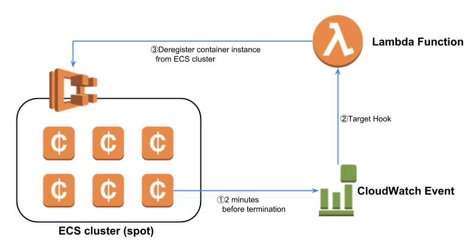

# Auto Deregistration EC2 Spot Instances from ECS Cluster

Example AWS CloudFormation template for deregistration from Amazon ECS Cluster for Amazon EC2 Spot Instances via Amazon CloudWatch Events & AWS Lambda.

## Getting Started

This CloudFormation template will deploy a rule of CloudWatch Events and a Lambda function with IAM Role.
When CloudWatch Events catch EC2 Spot Instance termination notice, Lambda function hooked automatically [deregister the ECS container instances](https://docs.aws.amazon.com/AmazonECS/latest/developerguide/deregister_container_instance.html) from ECS Cluster.
You can use this template independently.

### Architecture

### Prerequisites

Nothing. Lambda function searches target ECS Cluster automatically.

### Pricing

AWS CloudFormation is a free service; however, you are charged for the AWS resources you include in your stacks at the current rates for each. For more information about AWS pricing, go to the detail page for each product on http://aws.amazon.com.

## Deployment

After signing up for an AWS account, you can use AWS CloudFormation through the AWS Management Console, AWS CloudFormation API, or AWS CLI.

Use the [template](ecs-ec2-spot-auto-deregister.yaml) to create a CloudFormation stack.

You can learn more about working with CloudFormation stacks [here](http://docs.aws.amazon.com/AWSCloudFormation/latest/UserGuide/stacks.html).

## AWS services used

* [AWS CloudFormation](https://aws.amazon.com/cloudformation/)
* [Amazon EC2 Container Service (ECS)](https://aws.amazon.com/ecs/)
* [Amazon CloudWatch](https://aws.amazon.com/cloudwatch/)
* [AWS Lambda](https://aws.amazon.com/lambda/)

## Authors

* [**Kazuki Matsuda**](https://github.com/mats16)
