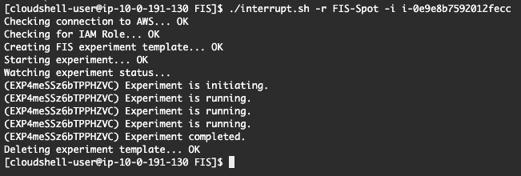

# Fault Injection Simulator

The [AWS Fault Injection Simulator (FIS)](https://aws.amazon.com/fis/) is a fully managed service for running fault injection experiments on AWS that makes it easier to improve an application’s performance, observability, and resiliency.  Through this it is now possible to receive Spot instance recommendations and notifications both on-instance and as an event.

## Spot Instance Interruption

In October 2021, FIS added the [ability to interrupt Spot Instances](https://docs.aws.amazon.com/fis/latest/userguide/fis-actions-reference.html#ec2-actions-reference) to its portfolio of features.  This introduced the capability for customers to fully test Spot instance interruptions through AWS rather than forcing scale-in, using [EC2 Metadata Mock](https://github.com/aws/amazon-ec2-metadata-mock), or by writing custom tooling.


## Requirements

FIS has certain prerequisites – they may only need to be configured once and forgotten later – but they are necessary for FIS to do its job.  Scroll to the bottom of this doc for more information if needed.

---

### [Interruption Simulator](./interrupt.sh)

The interruption simulator is a simple shell script that leverages the AWS CLI to send an FIS interruption to a specific instance in a single command.

#### Usage Synopsis


`-i <instance-id>` _(required - the target instance's ID)_

`-r <role>` _(requireed - the IAM role FIS should use)_

`[-m <minutes>]` _(optional - defaults to 2 minutes)_

`[--profile <profile>]` _(passed through to AWS CLI)_

`[--region <region> ]` _(passed through to AWS CLI)_


#### Usage Example

This screenshot is from Cloudshell, nothing pre-installed...


---

## FIS Spot IAM Helper

You will be required to create an [AWS Identity and Access Management (IAM)](https://aws.amazon.com/iam/) policy that permits Spot Instances to be interrupted.  The documentation for doing that can be found in the [FIS User Guide](https://docs.aws.amazon.com/fis/latest/userguide/getting-started-iam-service-role.html).

For those unfamiliar with FIS, we'll help simplify that process by giving specific templates you can use to accomplish this step.  Once complete any and all linked FIS tooling here at Spot Labs should function properly.

### FIS Spot Interruption IAM Policy

- Create an IAM policy called FIS-Spot
- Use the following JSON for that policy

```
{
    "Version": "2012-10-17",
    "Statement": [
        {
            "Sid": "AllowFISExperimentRoleReadOnly",
            "Effect": "Allow",
            "Action": "ec2:DescribeInstances",
            "Resource": "*"
        },
        {
            "Sid": "AllowFISExperimentRoleEC2Actions",
            "Effect": "Allow",
            "Action": "ec2:SendSpotInstanceInterruptions",
            "Resource": "arn:aws:ec2:*:*:instance/*"
        }
    ]
}
```

### FIS Spot Interruption IAM Role

- Create an IAM role called FIS-Spot
    - You will be asked what type of role to create
    - Use EC2 Instance, for now
- Attach the FIS-Spot policy to it

### FIS Spot Interruption IAM Trust Relationship

- Reassign this role to be use by the FIS service
- Use the JSON below to update the trust relationship

```
{
  "Version": "2012-10-17",
  "Statement": [
    {
      "Effect": "Allow",
      "Principal": {
        "Service": "fis.amazonaws.com"
      },
      "Action": "sts:AssumeRole"
    }
  ]
}
```


