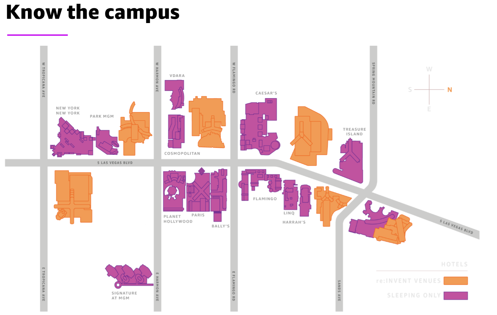

# EC2 Spot @ re:Invent 2019

Here is **THE COMPLETE** list of re:Invent sessions where you can learn about cost and capacity optimization.
#EC2Spot #SaveAtScale #SpotInstances

## BREAKOUT SESSIONS

### CMP202 - Better, Faster, Cheaper Compute - Cost Optimizing Amazon EC2

  - [Session 1](https://www.portal.reinvent.awsevents.com/connect/sessionDetail.ww?SESSION_ID=95739&csrftkn=UZWU-O509-DJPN-BGUB-UNAN-J3RA-7HDD-QO5F)
  - [Session 2](https://www.portal.reinvent.awsevents.com/connect/sessionDetail.ww?SESSION_ID=97223&csrftkn=UZWU-O509-DJPN-BGUB-UNAN-J3RA-7HDD-QO5F)

> It’s easier than ever to grow your compute capacity and enable new types of cloud computing applications while maintaining the lowest TCO by blending EC2 Spot, On-Demand and RI purchase models. In this session, learn how to use the power of EC2 with AWS services such as Auto Scaling, ECS, EKS, EMR, and Batch to programmatically optimize costs while maintaining high performance and availability‚ all without breaking a sweat. Finally we will dive deep into how EC2 Spot can help you optimize your EC2 usage for cost and performance. 

### CMP331 - Save up to 90% and Run Production Workloads on Spot

  - [Session 1](https://www.portal.reinvent.awsevents.com/connect/sessionDetail.ww?SESSION_ID=98830&csrftkn=UZWU-O509-DJPN-BGUB-UNAN-J3RA-7HDD-QO5F)
  - [Session 2](https://www.portal.reinvent.awsevents.com/connect/sessionDetail.ww?SESSION_ID=98831&csrftkn=UZWU-O509-DJPN-BGUB-UNAN-J3RA-7HDD-QO5F)

> In this session, learn how to effectively harness Spot Instances for production workloads. Amazon EC2 Spot Instances allow you to use spare EC2 computing capacity, which is often 90 percent less expensive than On-Demand prices. We explore application requirements to use Spot Instances, best practices learned from thousands of customers, and the services that make it easy. Finally, we run through practical examples of how to use Spot for the most common production workloads, the common pitfalls customers run into, and how to avoid them.

### CMP326 - Capacity Management Made Easy with Amazon EC2 Auto Scaling

  - [Session 1](https://www.portal.reinvent.awsevents.com/connect/sessionDetail.ww?SESSION_ID=98813&csrftkn=UZWU-O509-DJPN-BGUB-UNAN-J3RA-7HDD-QO5F)
  - [Session 2](https://www.portal.reinvent.awsevents.com/connect/sessionDetail.ww?SESSION_ID=98814&csrftkn=UZWU-O509-DJPN-BGUB-UNAN-J3RA-7HDD-QO5F)

> Amazon EC2 Auto Scaling offers a hands-free capacity management experience to help customers maintain a healthy fleet, improve application availability, and reduce costs. In this session, we deep-dive into how Amazon EC2 Auto Scaling works to simplify continuous fleet management and automatic scaling with changing load. Netflix delivers shows like Sacred Games, Stranger Things, Money Heist, and many more to more than 150 million subscribers across 190+ countries around the world. Netflix shares how Amazon EC2 Auto Scaling allows its infrastructure to automatically adapt to changing traffic patterns in order to keep its audience entertained and its costs on target.

### CON332 - Extreme infrastructure automation with Wavefront by VMware
  
  - [Session 1](https://www.portal.reinvent.awsevents.com/connect/sessionDetail.ww?SESSION_ID=98065&csrftkn=UZWU-O509-DJPN-BGUB-UNAN-J3RA-7HDD-QO5F)

> In this session, learn from Wavefront by VMware how to scale containerized infrastructure while increasing efficiency. Join this session to learn about intelligent Amazon EC2 instance size selection, pod placement, cost-optimization automation using Amazon EC2 Spot Instances, and next-generation reserved instance management. This presentation is brought to you by Spotinst, an APN Partner.

### CON308 - How Ticketmaster runs Kubernetes for 80% less without managing VMs
  
  - [Session 1](https://www.portal.reinvent.awsevents.com/connect/sessionDetail.ww?SESSION_ID=96848&csrftkn=UZWU-O509-DJPN-BGUB-UNAN-J3RA-7HDD-QO5F)

> Serverless containers are the future of containers infrastructure. Matching and scaling the right infrastructure resource to ever-changing microservices deployments is a challenge. In this talk, the Ticketmaster engineering team reviews the evolution of containers deployments and the automatic scaling of infrastructure in Kubernetes. They discuss the tradeoffs and introduce a new approach to deploying serverless containers using Spotinst Ocean. Join this session to learn how Ticketmaster was able to run 100 percent of its Amazon EC2 on Spot Instances with programmatic fallback to On-Demand Instances or Reserved Instances across multiple AWS accounts. This presentation is brought to you by Spotinst, an APN Partner.

### ARC209 - Running lean architectures: How to be cost-effective on AWS
  
  - [Session 1](https://www.portal.reinvent.awsevents.com/connect/sessionDetail.ww?SESSION_ID=97796&csrftkn=UZWU-O509-DJPN-BGUB-UNAN-J3RA-7HDD-QO5F)
  - [Session 2](https://www.portal.reinvent.awsevents.com/connect/sessionDetail.ww?SESSION_ID=97797&csrftkn=UZWU-O509-DJPN-BGUB-UNAN-J3RA-7HDD-QO5F)

> Everybody can save money on AWS by optimizing your architecture! This session reviews a wide range of cost-optimization strategies, featuring real-world examples. In addition to Reserved Instances, we have a special focus on Spot Instances to get a discount of up to 90 percent. We also talk about leveraging AWS Auto Scaling, caching and offloading content to Amazon CloudFront to reduce backend load, and much more. Running serverless? Learn how to cut costs on serverless through minimizing AWS Lambda execution time and maximizing networking throughput. Additionally, we cover optimizing training and inference costs for machine learning on AWS.

## CHALK TALKS

### CMP313 - Save by using multiple purchase options with Amazon EC2 Auto Scaling 

  - [Session 1](https://www.portal.reinvent.awsevents.com/connect/sessionDetail.ww?SESSION_ID=95752&csrftkn=UZWU-O509-DJPN-BGUB-UNAN-J3RA-7HDD-QO5F)
  - [Session 2](https://www.portal.reinvent.awsevents.com/connect/sessionDetail.ww?SESSION_ID=97215&csrftkn=UZWU-O509-DJPN-BGUB-UNAN-J3RA-7HDD-QO5F)

> Amazon EC2 Auto Scaling now makes it easier than ever to mix multiple purchase options and instance types in the same Auto Scaling group, so you can leverage the cost savings of Spot Instances with the stability of On-Demand and Reserved Instances within the same Auto Scaling group. In this chalk talk, we show you how Auto Scaling groups have made it easier than ever to deploy your applications.

### CMP336 - Save on Big Data Workloads like Apache Spark and Hadoop

  - [Session 1](https://www.portal.reinvent.awsevents.com/connect/sessionDetail.ww?SESSION_ID=98839&csrftkn=UZWU-O509-DJPN-BGUB-UNAN-J3RA-7HDD-QO5F)
  - [Session 2](https://www.portal.reinvent.awsevents.com/connect/sessionDetail.ww?SESSION_ID=98840&csrftkn=UZWU-O509-DJPN-BGUB-UNAN-J3RA-7HDD-QO5F)

> Learn how you can save on big data workloads by running Spot Instances on Amazon EMR. Access significantly higher compute capacity and reduce the time to process big datasets at a fraction of the cost. With Amazon EMR you can optimize for the right instance mix across Spot and On-Demand and simplify the setup process. Finally, learn how to increase cluster resilience by configuring transient and long-running clusters for the right mix of On-Demand and Spot Instances.

### CMP335 - Streamlining EC2 Instance Provisioning and Management

  - [Session 1](https://www.portal.reinvent.awsevents.com/connect/sessionDetail.ww?SESSION_ID=98838&csrftkn=UZWU-O509-DJPN-BGUB-UNAN-J3RA-7HDD-QO5F)

> Provisioning and managing instances is fundamental to creating a secure, scalable environment for your application. This session guides you through recommended practices for selecting instance types, provisioning resources, connecting to instances, building automation and governance, and monitoring and optimizing instance usage for your workloads. Learn how to move seamlessly from a proof of concept to an automated production environment using launch templates and newly launched features. We also cover some best practices and share tips on how you can simplify your instance launch experience.

### GPSTEC323 - How EC2 Spot can help you & your customers save money & scale performance
  
  - [Session 1](https://www.portal.reinvent.awsevents.com/connect/sessionDetail.ww?SESSION_ID=97691&csrftkn=UZWU-O509-DJPN-BGUB-UNAN-J3RA-7HDD-QO5F)

> Although this Global Partner Summit chalk talk is open to anyone, it is geared toward current and potential AWS Partner Network Partners. Have you heard of EC2 Spot but never really used it? Join us as we walk through how you can use EC2 Spot to spend less money, save time, and improve your scalability to deliver better customer outcomes. We cover best practices and reference architectures, and we dispel the myths, along with showing how you can integrate with your existing deployment tools and methodologies.

### FSI403 - How to build a Financial Services HPC cluster on AWS

  - [Session 1](https://www.portal.reinvent.awsevents.com/connect/sessionDetail.ww?SESSION_ID=95711&csrftkn=UZWU-O509-DJPN-BGUB-UNAN-J3RA-7HDD-QO5F)

> Have you ever needed to build a 10,000-core HPC cluster? And have you wondered what it would take to scale that cluster to 50,000 cores? This chalk talk explores different approaches to scaling a cost-efficient HPC cluster on AWS using Amazon EC2 Spot Instances. We consider HPC clusters used in risk measurements, actuarial calculations, high-frequency trading, and investment research modeling that use EC2 Spot Instances and Amazon FSx for Lustre as well as cost-management techniques for elastic clusters.

### ANT226 - Lower costs on Amazon EMR: AWS Auto Scaling and Spot pricing

  - [Session 1](https://www.portal.reinvent.awsevents.com/connect/sessionDetail.ww?SESSION_ID=97960&csrftkn=UZWU-O509-DJPN-BGUB-UNAN-J3RA-7HDD-QO5F)

> Amazon EMR enables customers to process and analyze big data at any scale. In this chalk talk, we share proven strategies to maximize utilization while minimizing costs for long-running clusters. We discuss how to get the most leverage from features like AWS Auto Scaling and Spot pricing. We also examine how changing design architecture decoupling of compute and storage impacts total cost of ownership and how appropriately sizing instances, clusters, and jobs will cost customers less.

## WORKSHOPS

### CMP401 - Running EC2 workloads at scale

  - [Session 1](https://www.portal.reinvent.awsevents.com/connect/sessionDetail.ww?SESSION_ID=95748&csrftkn=UZWU-O509-DJPN-BGUB-UNAN-J3RA-7HDD-QO5F)
  - [Session 2](https://www.portal.reinvent.awsevents.com/connect/sessionDetail.ww?SESSION_ID=96180&csrftkn=UZWU-O509-DJPN-BGUB-UNAN-J3RA-7HDD-QO5F)
  - [Session 3](https://www.portal.reinvent.awsevents.com/connect/sessionDetail.ww?SESSION_ID=96714&csrftkn=UZWU-O509-DJPN-BGUB-UNAN-J3RA-7HDD-QO5F)

> Join this workshop to get hands-on with the latest Amazon EC2 features, including Amazon EC2 Auto Scaling groups and Amazon EC2 launch templates, and AWS CodeDeploy. Learn how to utilize EC2 launch templates to power and deploy an EC2 Auto Scaling group using a combination of EC2 On-Demand and EC2 Spot Instances behind a load balancer. Next, configure the workload to handle peak demand with automatic scaling policies—while optimizing cost and performance.

### CMP410 - Save up to 90% on CI/CD and test workloads

  - [Session 1](https://www.portal.reinvent.awsevents.com/connect/sessionDetail.ww?SESSION_ID=96392&csrftkn=UZWU-O509-DJPN-BGUB-UNAN-J3RA-7HDD-QO5F)
  - [Session 2](https://www.portal.reinvent.awsevents.com/connect/sessionDetail.ww?SESSION_ID=96393&csrftkn=UZWU-O509-DJPN-BGUB-UNAN-J3RA-7HDD-QO5F)

>Learn how you can leverage Amazon EC2 Spot Instances to create CI/CD pipelines, Jenkins build agents, and test environments at a fraction of the cost of On-Demand Instances. We also implement mechanisms to ensure that our CI/CD pipelines remain available by decoupling application state from our compute resources. Finally, we migrate everything to a containered environment to eke out maximum performance and cost-efficiency. In addition to covering the ins and outs of Spot, we also share how some customers use Spot to reduce the cost of their test and production solutions

### CMP318 - Kubernetes on Spot Instances: Optimize for Scale and Cost

  - [Session 1](https://www.portal.reinvent.awsevents.com/connect/sessionDetail.ww?SESSION_ID=96396&csrftkn=UZWU-O509-DJPN-BGUB-UNAN-J3RA-7HDD-QO5F)
  - [Session 2](https://www.portal.reinvent.awsevents.com/connect/sessionDetail.ww?SESSION_ID=96395&csrftkn=UZWU-O509-DJPN-BGUB-UNAN-J3RA-7HDD-QO5F)

> Containers are usually stateless and fault-tolerant, and Amazon EC2 Spot Instances are a great match for powering container workloads. Attend this workshop to learn how to provision, manage, and maintain your Amazon Kubernetes clusters with Amazon EKS at any scale on Spot Instances while architecting to optimize cost and scale. We dive deep using hands-on material to provision and scale worker nodes, handle interruptions, and design for fault tolerance. We also demonstrate successfully managing a suddenly spiky workload. This workshop is designed to help architects, engineers, and developers understand how to run a containerized environment on Spot Instances.

## BUILDERS SESSIONS

### CMP416 - Scale Kuberenetes for less on Spot Instances

  - [Session 1](https://www.portal.reinvent.awsevents.com/connect/sessionDetail.ww?SESSION_ID=98821&csrftkn=UZWU-O509-DJPN-BGUB-UNAN-J3RA-7HDD-QO5F)
  - [Session 2](https://www.portal.reinvent.awsevents.com/connect/sessionDetail.ww?SESSION_ID=98822&csrftkn=UZWU-O509-DJPN-BGUB-UNAN-J3RA-7HDD-QO5F)
  - [Session 3](https://www.portal.reinvent.awsevents.com/connect/sessionDetail.ww?SESSION_ID=98823&csrftkn=UZWU-O509-DJPN-BGUB-UNAN-J3RA-7HDD-QO5F)

> In this builders session on containers, we cover how to optimize your Kubernetes clusters with Amazon Elastic Kubernetes Service (Amazon EKS) using a mixed worker node group of Amazon EC2 On-Demand and Spot Instances. We cover concepts of provisioning instances, scaling, and handling interruptions. This session provides a hands-on guide for developers and operations managers to explore.

### CMP403 - Running enterprise test/dev on Amazon EC2 Spot Instances

  - [Session 1](https://www.portal.reinvent.awsevents.com/connect/sessionDetail.ww?SESSION_ID=95758&csrftkn=UZWU-O509-DJPN-BGUB-UNAN-J3RA-7HDD-QO5F)
  - [Session 2](https://www.portal.reinvent.awsevents.com/connect/sessionDetail.ww?SESSION_ID=97207&csrftkn=UZWU-O509-DJPN-BGUB-UNAN-J3RA-7HDD-QO5F)
  - [Session 3](https://www.portal.reinvent.awsevents.com/connect/sessionDetail.ww?SESSION_ID=97208&csrftkn=UZWU-O509-DJPN-BGUB-UNAN-J3RA-7HDD-QO5F)
  - [Session 4](https://www.portal.reinvent.awsevents.com/connect/sessionDetail.ww?SESSION_ID=97209&csrftkn=UZWU-O509-DJPN-BGUB-UNAN-J3RA-7HDD-QO5F)

> Join this builder session to learn how to run an enterprise test/dev on Amazon EC2 Spot Instances. If you are new to Spot Instances and would like to take advantage of the cost savings, test/dev is a great place to start. Load, integration, canary, and security testing all benefit from the elasticity and price savings associated with Spot Instances. Learn how to use the EC2 Fleet API to diversify and use different instance pools to run test/dev.

### CMP404 - Running big data clusters on EMR with Spot Instances

  - [Session 1](https://www.portal.reinvent.awsevents.com/connect/sessionDetail.ww?SESSION_ID=95759&csrftkn=UZWU-O509-DJPN-BGUB-UNAN-J3RA-7HDD-QO5F)
  - [Session 2](https://www.portal.reinvent.awsevents.com/connect/sessionDetail.ww?SESSION_ID=97212&csrftkn=UZWU-O509-DJPN-BGUB-UNAN-J3RA-7HDD-QO5F)
  - [Session 3](https://www.portal.reinvent.awsevents.com/connect/sessionDetail.ww?SESSION_ID=97213&csrftkn=UZWU-O509-DJPN-BGUB-UNAN-J3RA-7HDD-QO5F)

> Join this builders session to learn how to run Big Data frameworks such as Apache Spark, Hadoop, and Hive through Amazon EMR while maximizing for scale, performance, and deep cost savings with Spot Instances. Learn how to configure clusters and instance fleets for the right mix of On-Demand and Spot Instances for long-running and transient workloads.

### CMP413 - Deploying EC2 Auto Scaling in your CI/CD pipeline

  - [Session 1](https://www.portal.reinvent.awsevents.com/connect/sessionDetail.ww?SESSION_ID=98806&csrftkn=UZWU-O509-DJPN-BGUB-UNAN-J3RA-7HDD-QO5F)
  - [Session 2](https://www.portal.reinvent.awsevents.com/connect/sessionDetail.ww?SESSION_ID=98807&csrftkn=UZWU-O509-DJPN-BGUB-UNAN-J3RA-7HDD-QO5F)
  - [Session 3](https://www.portal.reinvent.awsevents.com/connect/sessionDetail.ww?SESSION_ID=98808&csrftkn=UZWU-O509-DJPN-BGUB-UNAN-J3RA-7HDD-QO5F)

> Continuous integration and continuous deployment (CI/CD) with Auto Scaling can accelerate feature delivery to your customers and ensure higher availability and lower costs for your applications. This session provides hands-on experience to deploy your web app in an Auto Scaling group and set up a CI/CD pipeline with AWS CodeDeploy and AWS CodePipeline. Learn the best practices for setting up your Auto Scaling groups and scaling policies for a resilient infrastructure environment at a lower cost.

## What to expect in each type of session

**Breakout Sessions**

> re:Invent breakout sessions are lecture style and 60 minutes long. These sessions will take place throughout the re:Invent campus and cover all topics at all levels (200–400). Sessions are delivered by AWS experts, customers, and partners, and they typically include 10–15 minutes at the end for Q&A.

**Workshops**

> Workshops are two-hour, hands-on sessions where you work in teams to solve problems using AWS. Workshops organize attendees into small groups and provide scenarios to encourage interaction, giving you the opportunity to learn from and teach each other. Each workshop starts with a 10–15-minute lecture by the main speaker, and the rest of the time is spent working as a group. AWS will provide credits.

**Builders Sessions**

> Builders Sessions are 60-minute small groups sessions with up to five customers and one AWS expert, who is there to help, answer questions, and provide guidance. You will use your laptop to experiment and build with the AWS expert after a short demonstration. There is reserved seating for builders sessions. 

**Chalk Talks**

> Chalk talks are a highly interactive content format with a smaller audience. They begin with a 10–15-minute lecture delivered by an AWS expert, followed by a 45–50-minute Q&A session with the audience. The goal is to foster a technical discussion around real-world architecture challenges. Chalk talks are one hour and are presented by AWS experts. They have expert level content.

## Logistics

