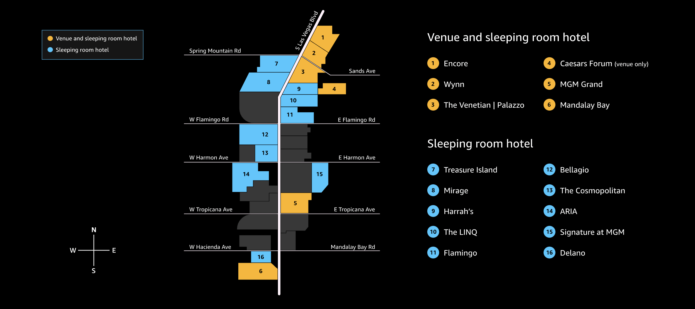

# Flexible Compute, ASG and EC2 Spot & re:Invent 2022

Here is **THE COMPLETE** list of re:Invent sessions where you can learn about compute, cost and capacity optimization
#FlexibleCompute #Graviton #EC2Spot #SaveAtScale #SpotInstances

If you are not attending re:Invent, we still have you covered! You can follow Breakout sessions using the [Virtual Registration Portal here](https://reinvent.awsevents.com/register/virtualregistration/).

## Logistics

## BREAKOUT SESSIONS

**Breakout Sessions**

> re:Invent breakout sessions are lecture style and 60 minutes long. These sessions will take place throughout the re:Invent campus and cover all topics at all levels (200–400). Sessions are delivered by AWS experts, customers, and partners, and they typically include 10–15 minutes at the end for Q&A.

### [CMP204 - Build a cost-, energy-, and resource-efficient compute environment](https://portal.awsevents.com/events/reinvent2022/dashboard/event/sessions/CMP204)

* When: Tuesday, November 29 - 2:00 PM - 3:00 PM
* Location: Convention Promenade, Lafite 5, Wynn
* Session type: Breakout Session
* Speaker: Adam Boeglin (AWS), Troy Gasaway (Arm Ltd)
* Learn about efficient compute environments, how they’re built, and how they reduce spend and carbon emissions.

> Compute services make up the foundation of many workloads, bringing great opportunity for cost, energy, and resource optimization. With over 500 instance types, multiple purchase options, managed services, serverless, and container options, it’s easy to build what you need while minimizing costs, resources, and energy usage. In this session, learn about efficient compute environments, how they’re built, and how they reduce spend and carbon emissions.

### [CMP210 - Modern applications: An infrastructure perspective](https://portal.awsevents.com/events/reinvent2022/dashboard/event/sessions/CMP210)

* When: Wednesday, November 30 - 7:00 PM - 8:00 PM 
* Location: Level 1 North, South Pacific F, Mandalay Bay
* Session type: Breakout Session
* Speaker: Yael Grossman, Sr. Specialist Solutions Architect, Flexible Compute, (AWS) Jeremy Atlan, Ground Trouth Architect, Mobileye
* This session dives into Auto Scaling group, Managed Node groups and Karpenter management patterns, instance sizing, scaling, and diversification strategies for improving the performance, resilience, and price of the workload. Mobileye also joins the session to share how they architected an Amazon EKS cluster for creating ground truth data to be performant, scalable, and cost effective.

>Modern applications are usually fault tolerant and stateless and can benefit from efficient compute design patterns. In some cases, there is a need for granular control of the underlying infrastructure for specific performance and latency needs. This session dives into Amazon EC2 Fleet and Auto Scaling group management patterns, instance sizing, scaling, and diversification strategies for improving the performance, resilience, and price of the workload. Learn about using Karpenter and Amazon EKS managed node groups. Mobileye also joins the session to share how they architected an Amazon EKS cluster for creating ground truth data to be performant, scalable, and cost effective.

### [CMP213 - Building a budget-conscious culture at Standard Chartered Bank - How to use cloud efficiently and effectively](https://portal.awsevents.com/events/reinvent2022/dashboard/event/sessions/CMP213)

* When: Thursday, December 1 - 2:00 PM - 3:00 PM
* Location : Level 2 South, Reef C, Mandalay Bay
* Session type: Breakout Session
* Speaker: Carlos Manzanedo Rueda, WW SA Lead for EC2 Flexible Compute - Spot, AWS, Daniel Kazarinow, Head of Cloud, Containers & Grid SRE, Standard Chartered Bank
* Learn how SCB applies FinOps and Flexible Compute techniques to optimize their compute.
* Overflow Room : [Level 1, Summit 231, Content Hub, Yellow Screen, Caesars Forum](https://portal.awsevents.com/events/reinvent2022/dashboard/event/sessions/CMP213-OF)

>In this session, Standard Chartered Bank shares how FinOps has been embedded in the way they build systems. Critical large systems at Standard Chartered Bank—such as scaling applications, container platforms, and their grid for calculating risk and analytics—use techniques to reduce waste and optimize cost and performance at scale. These techniques include using an optimal combination of AWS Savings Plans and Amazon EC2 Spot Instances, building for elasticity, and applying automation to switch down systems not in use.

### [CMP213 - Building a budget-conscious culture at Standard Chartered Bank - How to use cloud efficiently and effectively](https://portal.awsevents.com/events/reinvent2022/dashboard/event/sessions/CMP213)

* When: Thursday, December 1 - 2:00 PM - 3:00 PM
* Location : Level 2 South, Reef C, Mandalay Bay
* Session type: Breakout Session
* Speaker: Carlos Manzanedo Rueda, WW SA Lead for EC2 Flexible Compute - Spot, AWS, Daniel Kazarinow, Head of Cloud, Containers & Grid SRE, Standard Chartered Bank
* Learn how SCB applies FinOps and Flexible Compute techniques to optimize their compute.
* Overflow Room : [Level 1, Summit 231, Content Hub, Yellow Screen, Caesars Forum](https://portal.awsevents.com/events/reinvent2022/dashboard/event/sessions/CMP213-OF)

>In this session, Standard Chartered Bank shares how FinOps has been embedded in the way they build systems. Critical large systems at Standard Chartered Bank—such as scaling applications, container platforms, and their grid for calculating risk and analytics—use techniques to reduce waste and optimize cost and performance at scale. These techniques include using an optimal combination of AWS Savings Plans and Amazon EC2 Spot Instances, building for elasticity, and applying automation to switch down systems not in use.

## WORKSHOPS

**Workshops**

> Workshops are two-hour, hands-on sessions where you work in teams to solve problems using AWS. Workshops organize attendees into small groups and provide scenarios to encourage interaction, giving you the opportunity to learn from and teach each other. Each workshop starts with a 10–15-minute lecture by the main speaker, and the rest of the time is spent working as a group. AWS will provide credits.

### [CMP324-R - Spot the savings: Use Amazon EC2 Spot to optimize cloud deployments](https://portal.awsevents.com/events/reinvent2022/dashboard/event/sessions/CMP324)

* When: Monday, November 28 - 1:00 PM - 3:00 PM
* Location : Level 1, Academy 409, Caesars Forum
* Speaker: Ananth Raghavendra, Senior Solution Architect, Amazon Web Services

>Amazon EC2 Spot Instances are spare compute capacity available to you for less than On-Demand prices. EC2 Spot enables you to optimize your costs and scale your application’s throughput. This workshop walks you through the APIs and commands used to create Spot Instances: You create an EC2 launch template and then use the launch template to launch Spot Instances using EC2 Auto Scaling groups, EC2 Spot Fleet, EC2 Fleet, and EC2 RunInstances API. Also learn how to implement Spot functions such as Spot placement score, attribute-based instance selection, and AWS Fault Injection Simulator.

### [CMP324-R1 - Spot the savings: Use Amazon EC2 Spot to optimize cloud deployments](https://portal.awsevents.com/events/reinvent2022/dashboard/event/sessions/CMP324)

* When: Wednesday, November 30 - 6:15 PM - 8:15 PM
* Location : Upper Convention Promenade, Cristal 1, Wynn
* Speaker: Ananth Raghavendra, Senior Solution Architect, Amazon Web Services

>Amazon EC2 Spot Instances are spare compute capacity available to you for less than On-Demand prices. EC2 Spot enables you to optimize your costs and scale your application’s throughput. This workshop walks you through the APIs and commands used to create Spot Instances: You create an EC2 launch template and then use the launch template to launch Spot Instances using EC2 Auto Scaling groups, EC2 Spot Fleet, EC2 Fleet, and EC2 RunInstances API. Also learn how to implement Spot functions such as Spot placement score, attribute-based instance selection, and AWS Fault Injection Simulator.

### [CMP406 - Run Spark applications for less with Amazon EMR and Amazon EC2 Spot Instances](https://portal.awsevents.com/events/reinvent2022/dashboard/event/sessions/CMP406)

* When: Wednesday, November 30 - 12:15 PM - 2:15 PM
* Location : Level 2 South, Mandalay Bay Ballroom A, Mandalay Bay
* Speaker: Christian Melendez, Specialist Solutions Architect, Flexible Compute, AWS

>Wondering how to optimize costs when running Spark applications or speed up data processing without increasing your budget? In this workshop, learn how to optimize your Spark workloads using Amazon EMR and Amazon EC2 Spot Instances. Find out how to configure Amazon EMR using Instance Fleets and how to apply a selection criterion to diversify your workloads. Also learn how to dynamically scale your cluster as needed and use AWS Fault Injection Simulator to issue EC2 Spot interruptions and check what the impact of an interruption would be for your data and analytics workload.

### [CMP412 - Proactive auto scaling for optimal cost and availability](https://portal.awsevents.com/events/reinvent2022/dashboard/event/sessions/CMP412)

* When: Wednesday, November 30 - 5:30 PM - 7:30 PM
* Location : Level 2 South, Mandalay Bay Ballroom A, Mandalay Bay
* Speaker: Ahmed Nada, Sr. Solutions Architect, Amazon Web Services, Ankur Sethi, Sr. PMT, amazon Development Center

>Amazon EC2 Auto Scaling groups allow you to extract the elasticity benefits of the AWS Cloud. In this workshop, learn how to make the most of the latest innovations from Amazon EC2 Auto Scaling to further improve your web application availability at lower costs. Specifically, dive into using a combination of predictive scaling, dynamic scaling, and warm pool features to automatically launch and terminate capacity with changing demands throughout a day. With more responsive and proactive scaling, you run only the required number of instances at any time of the day, reducing the cost of overprovisioned Amazon EC2 instances. You must bring your laptop to participate.

### [CMP405 - Running efficient Kubernetes clusters on Amazon EC2 with Karpenter](https://portal.awsevents.com/events/reinvent2022/dashboard/event/sessions/CMP405)

* When: Wednesday, November 30 - 9:15 AM - 11:15 AM
* Location : Level 1, Margaux 1, Wynn
* Speaker: Brandon Wagner, Software Development Engineer, Amazon, Steve Cole, Principal Specialist Solutions Architect, Amazon

>In this workshop, learn how to provision, manage, and maintain your Kubernetes clusters with Amazon EKS at virtually any scale using Karpenter. Karpenter is a node lifecycle management solution used to scale your Kubernetes cluster. It observes incoming pods and launches the right instances for the situation. Instance selection decisions are intent-based and driven by the specification of incoming pods, including resource requests and scheduling constraints. You must bring your laptop to participate.

### [CMP405-R1 - Running efficient Kubernetes clusters on Amazon EC2 with Karpenter](https://portal.awsevents.com/events/reinvent2022/dashboard/event/sessions/CMP405-R1)

* When: Thursday, December 1 - 11:45 AM - 1:45 PM
* Location : Level 3, Murano 3301B, Venetian
* Speaker: Brandon Wagner, Software Development Engineer, Amazon, Steve Cole, Principal Specialist Solutions Architect, Amazon

>In this workshop, learn how to provision, manage, and maintain your Kubernetes clusters with Amazon EKS at virtually any scale using Karpenter. Karpenter is a node lifecycle management solution used to scale your Kubernetes cluster. It observes incoming pods and launches the right instances for the situation. Instance selection decisions are intent-based and driven by the specification of incoming pods, including resource requests and scheduling constraints. You must bring your laptop to participate.

## CHALK TALKS

**Chalk Talks**

> Chalk talks are a highly interactive content format with a smaller audience. They begin with a 10–15-minute lecture delivered by an AWS expert, followed by a 45–50-minute Q&A session with the audience. The goal is to foster a technical discussion around real-world architecture challenges. Chalk talks are one hour and are presented by AWS experts. They have expert level content.

### [CMP331 – High throughput computing for financial risk management and modeling](https://portal.awsevents.com/events/reinvent2022/dashboard/event/sessions/CMP331)

* When: Monday, November 28 1 - 0:00 AM - 11:00 AM
* Location : Level 1, Room 101, MGM Grand
* Speaker: Kirill Bogdanov, Sr. Solutions Architect, AWS Mark Norton, Principal EC2 & HPC Specialist, Amazon Web Services

>In this chalk talk, explore how financial services industry organizations can achieve greater elasticity, higher throughput, and significant cost savings with a cloud-native high-throughput computing (HTC) grid solution built on AWS core services. Using modular architecture made up of managed services such as Amazon EKS, Amazon DynamoDB, Amazon SQS, and Amazon EC2 Spot Instances, HTC grid solutions dynamically scale computing resources to meet the demanding throughput requirements of risk-analytics workloads. Join the talk to learn about the modular architecture, scalability, and performance you can achieve with this solution.

### [CMP331-R1 – High throughput computing for financial risk management and modeling](https://portal.awsevents.com/events/reinvent2022/dashboard/event/sessions/CMP331)

* When: November 30 - 6:15 PM - 7:15 PM
* Location : Level 1, Alliance 305, Caesars Forum
* Speaker: Kirill Bogdanov, Sr. Solutions Architect, AWS Mark Norton, Principal EC2 & HPC Specialist, Amazon Web Services

>In this chalk talk, explore how financial services industry organizations can achieve greater elasticity, higher throughput, and significant cost savings with a cloud-native high-throughput computing (HTC) grid solution built on AWS core services. Using modular architecture made up of managed services such as Amazon EKS, Amazon DynamoDB, Amazon SQS, and Amazon EC2 Spot Instances, HTC grid solutions dynamically scale computing resources to meet the demanding throughput requirements of risk-analytics workloads. Join the talk to learn about the modular architecture, scalability, and performance you can achieve with this solution.

### [CMP413 – High throughput computing for financial risk management and modeling](https://portal.awsevents.com/events/reinvent2022/dashboard/event/sessions/413)

* When: Monday, November 28 - 1:00 PM - 2:00 PM
* Location : Level 3, Room 306, MGM Grand
* Speaker: Kinnar Sen, Sr. Solution Architect, AWS

>Machine learning (ML) pipelines are comprised of multiple sequential steps that help to create a model from raw data. The compute requirements vary with the step, can be elastic in nature, and can be cost optimized. In this chalk talk, learn how various AWS compute tools and mechanisms—such as Amazon EC2 Auto Scaling groups, attribute-based instance type selection, AWS Fault Injection Simulator, and Amazon EC2 Spot Instances—can be used effectively to run ML pipelines. Also learn about distributed ML training, with application to how this process can be cost optimized using Amazon EC2 Spot Instances.

### [CMP413-R1 – High throughput computing for financial risk management and modeling](https://portal.awsevents.com/events/reinvent2022/dashboard/event/sessions/413)

* When: Thursday, December 1 - 4:15 PM - 5:15 PM
* Location : Level 1, Forum 101, Caesars Forum
* Speaker: Kinnar Sen, Sr. Solution Architect, AWS

>Machine learning (ML) pipelines are comprised of multiple sequential steps that help to create a model from raw data. The compute requirements vary with the step, can be elastic in nature, and can be cost optimized. In this chalk talk, learn how various AWS compute tools and mechanisms—such as Amazon EC2 Auto Scaling groups, attribute-based instance type selection, AWS Fault Injection Simulator, and Amazon EC2 Spot Instances—can be used effectively to run ML pipelines. Also learn about distributed ML training, with application to how this process can be cost optimized using Amazon EC2 Spot Instances.

### [CMP319 – Optimize for cost and availability with capacity management ](https://portal.awsevents.com/events/reinvent2022/dashboard/event/sessions/CMP319)

* When: Tuesday, November 29 - 5:00 PM - 6:00 PM
* Location : Level 3, Room 301, MGM Grand
* Speaker: Brian Phillippi, Principal Product Manager - Technical, Amazon

>Managing your capacity footprint at the enterprise level can be complex. This chalk talk covers how to plan for, acquire, monitor, and optimize your capacity footprint to achieve your goals of maximizing for capacity availability while minimizing costs. Leave this talk with an understanding of how to use Amazon EC2 Capacity Reservations, On-Demand Capacity Reservations, and Savings Plans to lower costs so that you can focus on innovating.

### [CMP322 – Deploying cost-effective, scalable video games on Kubernetes](https://portal.awsevents.com/events/reinvent2022/dashboard/event/sessions/CMP329)

* When: Tuesday, November 29 - 5:00 PM - 6:00 PM
* Location : Level 1, Room 101, MGM Grand
* Speaker: Yuval Dovrat, Sr. Manager, Solutions Architectecture, AWS, Yahav Biran, Principal Solutions Architect, AWS

>Managing your capacity footprint at the enterprise level can be complex. This chalk talk covers how to plan for, acquire, monitor, and optimize your capacity footprint to achieve your goals of maximizing for capacity availability while minimizing costs. Leave this talk with an understanding of how to use Amazon EC2 Capacity Reservations, On-Demand Capacity Reservations, and Savings Plans to lower costs so that you can focus on innovating.

### [CMP322-R1 – Deploying cost-effective, scalable video games on Kubernetes](https://portal.awsevents.com/events/reinvent2022/dashboard/event/sessions/CMP329-R1)

* When: Wednesday, November 30 - 2:30 PM - 3:30 PM
* Location : Convention Promenade, Lafite 4, Wynn
* Speaker: Yuval Dovrat, Sr. Manager, Solutions Architectecture, AWS, Yahav Biran, Principal Solutions Architect, AWS

>Managing your capacity footprint at the enterprise level can be complex. This chalk talk covers how to plan for, acquire, monitor, and optimize your capacity footprint to achieve your goals of maximizing for capacity availability while minimizing costs. Leave this talk with an understanding of how to use Amazon EC2 Capacity Reservations, On-Demand Capacity Reservations, and Savings Plans to lower costs so that you can focus on innovating.

### [CMP405-R1 - Running efficient Kubernetes clusters on Amazon EC2 with Karpenter](https://portal.awsevents.com/events/reinvent2022/dashboard/event/sessions/CMP405-R1)

* When: Thursday, December 1 - 11:45 AM - 1:45 PM
* Location : Level 3, Murano 3301B, Venetian
* Speaker: Brandon Wagner, Software Development Engineer, Amazon, Steve Cole, Principal Specialist Solutions Architect, Amazon

>In this workshop, learn how to provision, manage, and maintain your Kubernetes clusters with Amazon EKS at virtually any scale using Karpenter. Karpenter is a node lifecycle management solution used to scale your Kubernetes cluster. It observes incoming pods and launches the right instances for the situation. Instance selection decisions are intent-based and driven by the specification of incoming pods, including resource requests and scheduling constraints. You must bring your laptop to participate.

### [CMP323 – Deploying cost-effective, scalable video games on Kubernetes](https://portal.awsevents.com/events/reinvent2022/dashboard/event/sessions/CMP323)

* When: Wednesday, November 30 - 8:30 AM - 9:30 AM
* Location : Level 1, Summit 217, Caesars Forum
* Speaker: Peter Manastyrny, Senior Product Manager - Technical, Amazon, Sudheendra Bhat, Sr Solutions Architect, Amazon Web Services Inc

>Amazon EC2 instances power the majority of the applications and workloads on AWS. Collectively, Amazon EC2 Auto Scaling, Amazon EC2 Fleet, and Spot Fleet allow users to provision and maintain Amazon EC2 instances to power their workloads on AWS. In this chalk talk, learn the key differences between each of these provisioning mechanisms along with pros and cons of applying them to a few common use cases.
