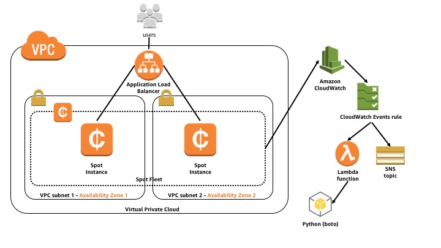

# Amazon EC2 Spot Fleet web app: Workshop guide
  
  
## Overview
[Amazon EC2 Spot Instances](https://aws.amazon.com/ec2/spot/) are spare compute capacity in the AWS cloud available to you at steep discounts compared to On-Demand prices. EC2 Spot enables you to optimize your costs on the AWS cloud and scale your application's throughput up to 10X for the same budget. By simply selecting Spot when launching EC2 instances, you can save up-to 90% on On-Demand prices.

This workshop is designed to get you familiar with EC2 Spot Instances by learning how to deploy a simple web app on an EC2 Spot Fleet behind an Elastic Load Balanacing Application Load Balancer and enable automatic scaling to allow it to handle peak demand, as well as handle Spot Instance interruptions.

## Requirements and notes
To complete this workshop, have the [AWS CLI](https://aws.amazon.com/cli/) installed and configured, and appropriate permissions to launch EC2 instances and launch CloudFormation stacks within your AWS account.

This workshop is self-paced. The instructions may use both the AWS CLI and AWS Management Console- feel free to use either or both as you are comfortable.

While the workshop provides step by step instructions, please do take a moment to look around and understand what is happening. The workshop is meant as a getting started guide, but you will learn the most by digesting each of the steps.

> **Note**: This workshop has been designed to run in the AWS Region **us-east-1 (Virginia)**. Please make sure you are operating in this region for all steps.

## Architecture

In this workshop, you will deploy the following:

* An Amazon Virtual Private Cloud (Amazon VPC) with subnets in two Availability Zones
* An Application Load Balancer (ALB) with a listener and target group
* An Amazon CloudWatch Events rule
* An AWS Lambda function
* An Amazon Simple Notification Service (SNS) topic
* Associated IAM policies and roles for all of the above
* An Amazon EC2 Spot Fleet request diversified across both Availability Zones using a couple of recent Spot Fleet features: Elastic Load Balancing integration and Tagging Spot Fleet Instances

When any of the Spot Instances receives an interruption notice, Spot Fleet sends the event to CloudWatch Events. The CloudWatch Events rule then notifies both targets, the Lambda function and SNS topic. The Lambda function detaches the Spot Instance from the Application Load Balancer target group, taking advantage of a full two minutes of connection draining before the instance is interrupted. The SNS topic also receives a message, and is provided as an example for the reader to use as an exercise (***hint***: have it send you an email or an SMS message).

Here is a diagram of the resulting architecture:



## Let's Begin!  

### 1\. Launch the CloudFormation stack

To save time on the initial setup, a CloudFormation template will be used to create the Amazon VPC with subnets in two Availability Zones, as well as the IAM policies and roles, and security groups.

1\. Go ahead and launch the CloudFormation stack. You can check it out from GitHub, or grab the template directly. I use the stack name “ec2-spot-fleet-web-app“, but feel free to use any name you like. Just remember to change it in the instructions.

```
$ git clone https://github.com/awslabs/ec2-spot-labs.git
```

```
$ aws cloudformation create-stack --stack-name ec2-spot-fleet-web-app --template-body file://ec2-spot-labs/workshops/ec2-spot-fleet-web-app/ec2-spot-fleet-web-app.yaml --capabilities CAPABILITY_IAM --region us-east-1
```

You should receive a StackId value in return, confirming the stack is launching.

```
{
	"StackId": "arn:aws:cloudformation:us-east-1:123456789012:stack/spot-fleet-web-app/083e7ad0-0ade-11e8-9e36-500c219ab02a"
}
```

2\. Wait for the status of the CloudFormation stack to move to **CREATE_COMPLETE** before moving on to the next step. You will need to reference the **Output** values from the stack in the next steps.

### 2\. Deploy the Application Load Balancer

To deploy your Application Load Balancer and Spot Fleet in your AWS account, you will begin by signing in to the AWS Management Console with your user name and password. 

1\. Go to the EC2 console by choosing **EC2** under **Compute**.

2\. Next, choose **Load Balancers** in the navigation pane. This page shows a list of load balancer types to choose from.

3\. Choose **Create** in the **Application Load Balancer** box. 

4\. Give your load balancer a **name**.

5\. You can leave the rest of the **Basic Configuration** and **Listeners** options as **default** for the purposes of this workshop.

6\. Under **Availability Zones**, you'll need to select the **VPC** created by the CloudFormation stack you launched in the previous step, and then select both **Availability Zones** for the Application Load Balancer to route traffic to. Best practices for both load balancing and Spot Fleet are to select at least two Availability Zones - ideally you should select as many as possible. Remember that you can specify only one subnet per Availability Zone.

7\. Once done, click on **Next: Configure Security Settings**.

>**Note**: Since this is a demonstration, we will continue without configuring a secure listener. However, if this was a production load balancer, it is recommended to configure a secure listener if your traffic to the load balancer needs to be secure.

8\. Go ahead and click on Next: Configure Security Groups. Choose **Select an existing security group**, then select both the **default** security group, and the security group created in the CloudFormation stack.

9\. Click on **Next: Configure Routing**.

10\. In the **Configure Routing section**, we'll configure a **Target group**. Your load balancer routes requests to the targets in this target group using the protocol and port that you specify, and performs health checks on the targets using these health check settings. Give your Target group a **Name**, and leave the rest of the options as default under **Target group**, **Health checks**, and **Advanced health check settings**.

11\. Click on **Next: Register Targets**. On the **Register Targets** section, we don't need to register any targets or instances at this point because we will do this when we configure the EC2 Spot Fleet.

12\. Click on **Next: Review**.

13\. Here you can review your settings. Once you are done reviewing, click **Create**.

14\. You should get a return that your Application Load Balancer was successfully created.

15\. Click **Close**.

16\. You'll need to make a note of the ARN of the Target group you created, as you'll be using it a few times in the following steps. Back on the EC2 console, choose **Target Groups** in the navigation pane. This page shows a list of Target groups to choose from. Select the Target group you just created, and copy/paste the full ARN of the Target group listed below in the **Basic Configuration** of the **Description** tab somewhere for easy access in the later steps (or simply know where to refer back when you need it).

Example Target group ARN:
```arn:aws:elasticloadbalancing:us-east-1:123456789012:targetgroup/aa/cdbe5f2266d41909```

### 3\. Launch an EC2 Spot Fleet and associate the Load Balancing Target Group with it

In this section, we'll launch an EC2 Spot Fleet and have the Spot Instances automatically associate themselves with the load balancer we created in the previous step.

1\. Head to **Spot Requests** in the navigation pane.

2\. Click on **Request Spot Instances**.

3\. Select **Request and Maintain** under **Request type**. This requests a fleet of Spot instances to maintain your target capacity.
 
4\. Under **Amount**, set the **Total target capacity** = *2*, and leave the **Optional On-Demand portion** = *0*.

5\. We'll make a few changes under **Requirements**. First, leave the **AMI** with the default **Amazon Linux AMI**.

6\. Let's add an additional Instance type by clicking **Select**, and then checking both **c3.large** and **c4.large**. This will allow the Spot Fleet to be flexible across both instance types when it is requesting Spot capacity. Click **Select** to save your changes.

7\. For **Network**, make sure to select the same **VPC** you used when creating the Application Load Balancer.

8\. Then check the same **Availability Zones** and **Subnets** you selected when creating the Application Load Balancer.

9\. Check *Replace unhealthy instances* at **Health check**.

10\. Check the **default** Security group.

11\. Select a **Key pair** name if you'd like to enable ssh access to your instances *(not required for this workshop)*.

12\. In the **User data** field, enter the following data as text:

```
#!/bin/bash
yum -y update
yum -y install httpd
chkconfig httpd on
instanceid=$(curl http://169.254.169.254/latest/meta-data/instance-id)
echo "hello from $instanceid" > /var/www/html/index.html
service httpd start
```

>For this next step, you'll need to full Target group ARN you noted earlier in step 2.16.

13\. You'll need to add an instance tag that includes the name of the load balancer target group created in the load balancer creation step earlier. Click **add new tag** and set **key** = *loadBalancerTargetGroup*, **value** = *[FULL-TARGET-GROUP-ARN]*

Example Target group ARN:
```arn:aws:elasticloadbalancing:us-east-1:123456789012:targetgroup/aa/cdbe5f2266d41909```

14\. Under **Load balancing**, check the **Load balancing** box to receive traffic from one or more load balancers. Select the Target group you created in the earlier step of creating the Application Load Balancer.

15\. Under **Spot request fulfillment**, change **Allocation strategy** to *Diversified*, and leave the rest of the settings as **default** options.

16\. Click **Launch**.

17\. Take a moment to review the Spot Fleet request in the Spot console. You should see *2* Spot Instance requests being fulfilled. Click around to get a good feel for the Spot console.

18\. Head back to **Target Groups** in the navigation pane and select your Target group. Select the **Targets** tab below and note the Spot Instances becoming available in the **Registered targets** and **Availability Zones**.

### 4\. Configure Automatic Scaling for the Spot Fleet

In this section, we'll configure automatic scaling for the Spot Fleet so it can scale based on the Application Load Balancer Request Count Per Target.

1\. Head back to **Spot Requests** in the navigation pane.

2\. Select the **Spot Fleet Request Id** that you just launched.

3\. In the **lower section details**, click on the **Auto Scaling** tab. Click the **Configure** button.

4\. You can now select details for how your Spot Fleet will scale. Set the **Scale capacity** between *2* and *10* instances.

5\. In **Scaling policies**, change the **Target metric** to *Application Load Balancer Request Count Per Target*.

6\. This will show a new field **Application Load Balancer target group**. Select the **Target Group** created in the earlier step.

7\. Leave the rest of the settings as **default**.

8\. Click **Save**.

You have now attached a target based automatic scaling policy to your Spot Fleet.

### 5\. Test

### 6\. Enable the Spot Instance interruption notice handler Lambda function

### 7\. Test the Spot Instance interruption notice handler

### 8\. Extra credit - 


* * *

## Finished!  
Congratulations on completing the workshop...*or at least giving it a good go*!  This is the workshop's permananent home, so feel free to revisit as often as you'd like.  In typical Amazon fashion, we'll be listening to your feedback and iterating to make it better.  If you have feedback, we're all ears!  Make sure you clean up after the workshop, so you don't have any unexpected charges on your next monthly bill.  

* * *

## Workshop Cleanup

1. Working backwards, delete all manually created resources.
3. Delete the CloudFormation stack launched at the beginning of the workshop.

* * *

## Appendix  

### Resources
Here are additional resources to learn more about Amazon EC2 Spot Instances.  

* [Amazon EC2 Spot Instances](https://aws.amazon.com/ec2/spot)
* [Amazon EC2 Spot Labs GitHub Repo](https://github.com/awslabs/ec2-spot-labs/)
* [Amazon EC2 Spot Fleet Jenkins Plugin](https://wiki.jenkins.io/display/JENKINS/Amazon+EC2+Fleet+Plugin)

### Articles
* [Taking Advantage of Amazon EC2 Spot Instance Interruption Notices](https://aws.amazon.com/blogs/compute/taking-advantage-of-amazon-ec2-spot-instance-interruption-notices/)
* [Powering Your Amazon ECS Clusters with Spot Fleet](https://aws.amazon.com/blogs/compute/powering-your-amazon-ecs-clusters-with-spot-fleet/)


